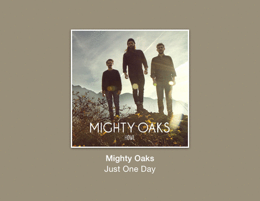

# 动画解释

我们写的应用程序往往都不是静态的，因为它们需要适应用户的需求以及为执行各种任务而改变状态。

在这些状态之间转换时，清晰的揭示正在发生什么是非常重要的。而不是在页面之间跳跃，动画帮助我们解释用户从哪里来，要到哪里去。

键盘在 view 中滑进滑出给了我们一个错觉，让我们以为它是简单的被隐藏在屏幕下方的，并且是手机很自然的一个部分。View controller 转场加强了我们的应用程序的导航结构，并且给了用户正在移向哪个方向的提示。微妙的反弹和碰撞使界面栩栩如生，并且激发出了物理的质感。要是没有这些的话，我们就只有一个没有视觉修饰的干巴巴环境了。

动画是叙述你的应用的故事的绝佳方式，在了解动画背后的基本原理之后，设计它们会轻松很多。

## 首要任务

在这篇文章 (以及这个话题中其余大多数文章) 中，我们将特别地针对 Core Animation 进行探讨。虽然你将看到的很多东西也可以用更高层级的 UIKit 的方法来完成，但是 Core Animation 将会让你更好的理解正在发生什么。它以一种更明确的方式来描述动画，这对这篇文章读者以及你自己的代码的读者来说都非常有用。

在看动画如何与我们在屏幕上看到的内容交互之前，我们需要快速浏览一下 Core Animation 的 `CALayer`，这是动画产生作用的地方。

你大概知道 `UIView` 实例，以及 layer-backed 的 `NSView`，修改它们的 `layer` 来委托强大的 Core Graphics 框架来进行渲染。然而，你务必要理解，当把动画添加到一个 layer 时，是不直接修改它的属性的。

取而代之，Core Animation 维护了两个平行 layer 层次结构： _model layer tree（模型层树）_ 和 _presentation layer tree（表示层树）_。前者中的 layers 反映了我们能直接看到的 layers 的状态，而后者的 layers 则是动画正在表现的值的近似。

> 实际上还有所谓的第三个 layer 树，叫做 _rendering tree（渲染树）_。因为它对 Core Animation 而言是私有的，所以我们在这里不讨论它。

考虑在 view 上增加一个渐出动画。如果在动画中的任意时刻，查看 layer 的 `opacity` 值，你是得不到与屏幕内容对应的透明度的。取而代之，你需要查看 presentation layer 以获得正确的结果。

虽然你可能不会去直接设置 presentation layer 的属性，但是使用它的当前值来创建新的动画或者在动画发生时与 layers 交互是非常有用的。

通过使用 `-[CALayer presentationLayer]` 和 `-[CALayer modelLayer]`，你可以在两个 layer 之间轻松切换。

## 基本动画

可能最常见的情况是将一个 view 的属性从一个值改变为另一个值，考虑下面这个例子：

在这里，我们让红色小火箭的 x-position 从 `77.0` 变为 `455.0`，刚好超过它的 parent view 的边。为了填充所有路径，我们需要确定我们的火箭在任意时刻所到达的位置。这通常使用线性插值法来完成：

也就是说，对于动画给定的一个分数 `t`，火箭的 x 坐标就是起始点的 x 坐标 `77`，加上一个到终点的距离 `∆x = 378` 乘以该分数的值。

使用 `CABasicAnimation`，我们可以如下实现这个动画：

    CABasicAnimation *animation = [CABasicAnimation animation];
    animation.keyPath = @"position.x";
    animation.fromValue = @77;
    animation.toValue = @455;
    animation.duration = 1;

    [rocket.layer addAnimation:animation forKey:@"basic"];

请注意我们要动画的键路径，也就是 `position.x`，实际上包含一个存储在 `position` 属性中的 `CGPoint` 结构体成员。这是 Core Animation 一个非常方便的特性。请务必查看[支持的键路径的完整列表](https://developer.apple.com/library/ios/documentation/Cocoa/Conceptual/CoreAnimation_guide/Key-ValueCodingExtensions/Key-ValueCodingExtensions.html)。

然而，当我们运行该代码时，我们意识到火箭在完成动画后马上回到了初始位置。这是因为在默认情况下，动画不会在超出其持续时间后还修改 presentation layer。实际上，在结束时它甚至会被彻底移除。

一旦动画被移除，presentation layer 将回到 model layer 的值，并且因为我们从未修改该 layer 的 `position` 属性，所以我们的飞船将重新出现在它开始的地方。

这里有两种解决这个问题的方法：

第一种方法是直接在 model layer 上更新属性。_这是推荐的的做法_，因为它使得动画完全可选。

一旦动画完成并且从 layer 中移除，presentation layer 将回到 model layer 设置的值，而这个值恰好与动画最后一个步骤相匹配。

    CABasicAnimation *animation = [CABasicAnimation animation];
    animation.keyPath = @"position.x";
    animation.fromValue = @77;
    animation.toValue = @455;
    animation.duration = 1;

    [rocket.layer addAnimation:animation forKey:@"basic"];

    rocket.layer.position = CGPointMake(455, 61);

或者，你可以通过设置动画的 `fillMode` 属性为 ` kCAFillModeForward` 以留在最终状态，并设置`removedOnCompletion` 为 `NO` 以防止它被自动移除：

    CABasicAnimation *animation = [CABasicAnimation animation];
    animation.keyPath = @"position.x";
    animation.fromValue = @77;
    animation.toValue = @455;
    animation.duration = 1;

    animation.fillMode = kCAFillModeForward;
    animation.removedOnCompletion = NO;

    [rectangle.layer addAnimation:animation forKey:@"basic"];

[Andy Matuschak 指出了](https://twitter.com/andy_matuschak/status/464799423785336832)，如果将已完成的动画保持在 layer 上时，会造成额外的开销，因为渲染器会去进行额外的绘画工作。

值得指出的是，实际上我们创建的动画对象在被添加到 layer 时立刻就复制了一份。这个特性在多个 view 中重用动画时这非常有用。比方说我们想要第二个火箭在第一个火箭起飞不久后起飞：

    CABasicAnimation *animation = [CABasicAnimation animation];
    animation.keyPath = @"position.x";
    animation.byValue = @378;
    animation.duration = 1;

    [rocket1.layer addAnimation:animation forKey:@"basic"];
    rocket1.layer.position = CGPointMake(455, 61);

    animation.beginTime = CACurrentMediaTime() + 0.5;

    [rocket2.layer addAnimation:animation forKey:@"basic"];
    rocket2.layer.position = CGPointMake(455, 111);

设置动画的 `beginTime` 为未来 0.5 秒将只会影响 `rocket2`，因为动画在执行语句 `[rocket1.layer addAnimation:animation forKey:@"basic"];` 时已经被复制了，并且之后 `rocket1` 也不会考虑对动画对象的改变。

不妨看一看 David 的 [关于动画时间的一篇很棒的文章](http://ronnqvi.st/controlling-animation-timing/)，通过它可以学习如何更精确的控制你的动画。

我决定再使用 `CABasicAnimation` 的 `byValue` 属性创建一个动画，这个动画从 presentation layer 的当前值开始，加上 `byValue` 的值后结束。这使得动画更易于重用，因为你不需要精确的指定可能无法提前知道的 `from-` 和 `toValue` 的值。

 `fromValue`, `byValue` 和 `toValue` 的不同组合可以用来实现不同的效果，如果你需要创建一个可以在你的不同应用中重用的动画，你可以[查看文档](https://developer.apple.com/library/ios/documentation/GraphicsImaging/Reference/CABasicAnimation_class/Introduction/Introduction.html#//apple_ref/doc/uid/TP40004496-CH1-SW4)。

## 多步动画

这很容易想到一个场景，你想要为你的动画定义超过两个步骤，我们可以使用更通用的 `CAKeyframeAnimation`，而不是去链接多个 `CABasicAnimation` 实例。

关键帧（keyframe）使我们能够定义动画中任意的一个点，然后让 Core Animation 填充所谓的中间帧。

比方说我们正在制作我们下一个 iPhone 应用程序上的登陆表单，我们希望当用户输入错误的密码时表单会晃动。使用关键帧动画，看起来大概像下面这样：

    CAKeyframeAnimation *animation = [CAKeyframeAnimation animation];
    animation.keyPath = @"position.x";
    animation.values = @[ @0, @10, @-10, @10, @0 ];
    animation.keyTimes = @[ @0, @(1 / 6.0), @(3 / 6.0), @(5 / 6.0), @1 ];
    animation.duration = 0.4;

    animation.additive = YES;

    [form.layer addAnimation:animation forKey:@"shake"];

`values` 数组定义了表单应该到哪些位置。

设置 `keyTimes` 属性让我们能够指定关键帧动画发生的时间。它们被指定为关键帧动画总持续时间的一个分数。

> 请注意我是如何选择不同的值从 0 到 10 和从 10 到 -10 转换以维持恒定的速度的。

设置 `additive` 属性为 `YES` 使 Core Animation 在更新 presentation layer 之前将动画的值添加到 model layer 中去。这使我们能够对所有形式的需要更新的元素重用相同的动画，且无需提前知道它们的位置。因为这个属性从 `CAPropertyAnimation` 继承，所以你也可以在使用 `CABasicAnimation` 时使用它。

## 沿路径的动画

虽然用代码实现一个简单的水平晃动并不难，但是沿着复杂路径的动画就需要我们在关键帧的 `values` 数组中存储大量 box 化的 `CGPoint`。 值得庆幸的是，`CAKeyframeAnimation`  提供了更加便利的 `path` 属性作为代替。

举个例子，我们如何让一个 view 做圆周运动：

    CGRect boundingRect = CGRectMake(-150, -150, 300, 300);

    CAKeyframeAnimation *orbit = [CAKeyframeAnimation animation];
    orbit.keyPath = @"position";
    orbit.path = CFAutorelease(CGPathCreateWithEllipseInRect(boundingRect, NULL));
    orbit.duration = 4;
    orbit.additive = YES;
    orbit.repeatCount = HUGE_VALF;
    orbit.calculationMode = kCAAnimationPaced;
    orbit.rotationMode = kCAAnimationRotateAuto;

    [satellite.layer addAnimation:orbit forKey:@"orbit"];

使用 `CGPathCreateWithEllipseInRect()`，我们创建一个圆形的 `CGPath` 作为我们的关键帧动画的 `path`。

使用 `calculationMode` 是控制关键帧动画时间的另一种方法。我们通过将其设置为 `kCAAnimationPaced`，让 Core Animation 向被驱动的对象施加一个恒定速度，不管路径的各个线段有多长。将其设置为 `kCAAnimationPaced` 将无视所有我们已经设置的 `keyTimes`。

设置 `rotationMode` 属性为 `kCAAnimationRotateAuto` 确保飞船沿着路径旋转。作为对比，如果我们将该属性设置为 `nil` 那动画会是什么样的呢。

你可以使用带路径的动画来实现几个有趣的效果；资深 objc.io 作者 [Ole Begemann](https://twitter.com/olebegemann) 写了[一篇文章](http://oleb.net/blog/2010/12/animating-drawing-of-cgpath-with-cashapelayer)，阐述了如何将 `CAShapeLayer` 与基于路径的动画组合起来使用，并只用几行代码来创建酷炫的绘图动画。

## 时间函数

让我们再次来看看第一个例子：

你会发现我们的火箭的动画有一些看起来非常不自然的地方。那是因为我们在现实世界中看到的大部分运动需要时间来加速或减速。对象瞬间达到最高速度，然后再立即停止往往看起来非常不自然。除非你在让[机器人跳舞](https://www.youtube.com/watch?v=o8HkEprSaAs&t=1m2s)，但这很少是想要的效果。

为了给我们的动画一个存在惯性的感觉，我们可以使用我们上面提到的参数因子来进行插值。然而，如果我们接下来需要为每个需要加速或减速的行为创建一个新的插值函数，这将是一个很难扩展的方法。

取而代之，常见的做法是把要进行动画的属性的插值从动画的速度中解耦出来。这样一来，给动画提速会产生一种小火箭加速运动的效果，而不用改变我们的插值函数。

我们可以通过引入一个 _时间函数 (timing function)_ （有时也被称为 easing 函数）来实现这个目标。该函数通过修改持续时间的分数来控制动画的速度。

最简单的 easing 函数是 _linear_。它在整个动画上维持一个恒定的速度。在 Core Animation 中，这个功能由 `CAMediaTimingFunction` 类表示。

    CABasicAnimation *animation = [CABasicAnimation animation];
    animation.keyPath = @"position.x"; 
    animation.fromValue = @50;
    animation.toValue = @150;
    animation.duration = 1;

    animation.timingFunction = [CAMediaTimingFunction functionWithName:kCAMediaTimingFunctionLinear];

    [rectangle.layer addAnimation:animation forKey:@"basic"];

    rectangle.layer.position = CGPointMake(150, 0);

Core Animation 附带了一些 linear 之外的内置 easing 函数，如：

* Ease in (`kCAMediaTimingFunctionEaseIn`):  

* Ease out (`kCAMediaTimingFunctionEaseOut`):  

* Ease in ease out (`kCAMediaTimingFunctionEaseInEaseOut`):  

* 默认 (`kCAMediaTimingFunctionDefault`):  

在一定限度内，你也可以使用 `+functionWithControlPoints::::` 创建自己的 easing 函数。通过传递 cubic Bézier 曲线的两个控制点的 _x_ 和 _y_ 坐标，你可以轻松的创建自定义 easing 函数，比如我为我们的红色小火箭选择的那个。

> 这个方法因为有三个无名参数而声名狼藉，我们并不推荐在你的 API 中使用这种蛋疼的写法。

    CABasicAnimation *animation = [CABasicAnimation animation];
    animation.keyPath = @"position.x";
    animation.fromValue = @77;
    animation.toValue = @455;
    animation.duration = 1;

    animation.timingFunction = [CAMediaTimingFunction functionWithControlPoints:0.5:0:0.9:0.7];

    [rocket.layer addAnimation:animation forKey:@"basic"];

    rocket.layer.position = CGPointMake(150, 0);

我不打算讲太多关于 Bézier 曲线的细节，在计算机图形学中，它们是创建平滑曲线的常用技术。你可能在基于矢量的绘图工具，比如 Sketch 或 Adobe Illustrator 中见过它们。

传递给 `+functionWithControlPoints::::` 的值有效地控制了控制点的位置。所得到的定时函数将基于得到的路径来调整动画的速度。x 轴代表时间的分数，而 y 轴是插值函数的输入值。

遗憾的是，由于这些部分被锁定在 `[0–1]` 的范围内，我们不可能用它来创建一些像预期动作 (Anticipation，一种像目标进发前先回退一点，到达目标后还过冲一会儿，见下图) 这样的常见效果。

我写了一个小型库，叫做 [RBBAnimation](https://github.com/robb/RBBAnimation)，它包含一个允许使用 [更多复杂 easing 函数](https://github.com/robb/RBBAnimation#rbbtweenanimation) 的自定义子类 `CAKeyframeAnimation`，包括反弹和包含负分量的 cubic Bézier 函数：

    RBBTweenAnimation *animation = [RBBTweenAnimation animation];
    animation.keyPath = @"position.x";
    animation.fromValue = @50;
    animation.toValue = @150;
    animation.duration = 1;

    animation.easing = RBBCubicBezier(0.68, -0.55, 0.735, 1.55);

    RBBTweenAnimation *animation = [RBBTweenAnimation animation];
    animation.keyPath = @"position.x";
    animation.fromValue = @50;
    animation.toValue = @150;
    animation.duration = 1;

    animation.easing = RBBEasingFunctionEaseOutBounce;

## 动画组

对于某些复杂的效果，可能需要同时为多个属性进行动画。想象一下，在一个媒体播放程序中，当切换到到随机曲目时我们让随机动画生效。看起来就像下面这样：

你可以看到，我们需要同时对上面的封面的 position，rotation 和 z-position 进行动画。使用 `CAAnimationGroup` 来动画其中一个封面的代码大概如下：

    CABasicAnimation *zPosition = [CABasicAnimation animation];
    zPosition.keyPath = @"zPosition";
    zPosition.fromValue = @-1;
    zPosition.toValue = @1;
    zPosition.duration = 1.2;

    CAKeyframeAnimation *rotation = [CAKeyframeAnimation animation];
    rotation.keyPath = @"transform.rotation";
    rotation.values = @[ @0, @0.14, @0 ];
    rotation.duration = 1.2;
    rotation.timingFunctions = @[
        [CAMediaTimingFunction functionWithName:kCAMediaTimingFunctionEaseInEaseOut],
        [CAMediaTimingFunction functionWithName:kCAMediaTimingFunctionEaseInEaseOut]
    ];

    CAKeyframeAnimation *position = [CAKeyframeAnimation animation];
    position.keyPath = @"position";
    position.values = @[
        [NSValue valueWithCGPoint:CGPointZero],
        [NSValue valueWithCGPoint:CGPointMake(110, -20)],
        [NSValue valueWithCGPoint:CGPointZero]
    ];
    position.timingFunctions = @[
        [CAMediaTimingFunction functionWithName:kCAMediaTimingFunctionEaseInEaseOut],
        [CAMediaTimingFunction functionWithName:kCAMediaTimingFunctionEaseInEaseOut]
    ];
    position.additive = YES;
    position.duration = 1.2;

    CAAnimationGroup *group = [[CAAnimationGroup alloc] init];
    group.animations = @[ zPosition, rotation, position ];
    group.duration = 1.2;
    group.beginTime = 0.5;

    [card.layer addAnimation:group forKey:@"shuffle"];

    card.layer.zPosition = 1;

我们使用 `CAAnimationGroup` 得到的一个好处是可以将所有动画作为一个对象暴露出去。如果你要在应用程序中的多个地方用工厂对象创建的重用的动画的话，这将会非常有用。

你也可以使用动画组同时控制所有动画组成部分的时间。

## Core Animation 之外

都现在了，你应该已经听说过 UIKit Dynamics 了，这是 iOS 7 中引入的一个物理模拟框架，它允许你使用约束和力来为 views 做动画。与 Core Animation 不同，它与你在屏幕上看到的内容交互更为间接，但是它的动态特性让你可以在事先不知道结果时创建动画。

Facebook 最近开源了 Paper 背后的动画引擎 [Pop](https://github.com/facebook/pop)。从概念上讲，它介于 Core Animation 和 UIKit Dynamics 之间。它完美的使用了弹簧（spring）动画，并且能够在动画运行时操控目标值，而无需替换它。Pop 也可以在 OS X 上使用，并且允许我们在每个 `NSObject` 的子类中为任意属性进行动画。

## 扩展阅读

- [Core Animation 编程指南](https://developer.apple.com/library/ios/documentation/Cocoa/Conceptual/CoreAnimation_guide/Introduction/Introduction.html)
- [动画的 12 个基本原则](https://en.wikipedia.org/wiki/12_basic_principles_of_animation)
- [使用 CAShapeLayer 的 CGPath 动画绘图](http://oleb.net/blog/2010/12/animating-drawing-of-cgpath-with-cashapelayer)
- [控制动画时间](http://ronnqvi.st/controlling-animation-timing/)
- [pop](https://github.com/facebook/pop)
- [RBBAnimation](https://github.com/robb/RBBAnimation)
