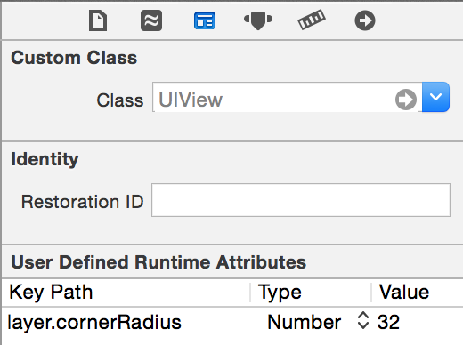
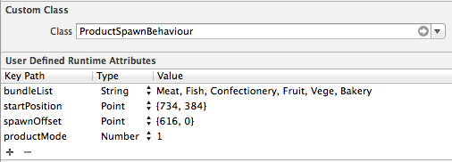

# iOS 中的行为

作为一个开发者，我们致力于编写简洁并且良好架构的代码。很多设计模式都可以实现这一点，其中最好的一种是组合模式。组合模式使编写出的代码更易于遵循功能单一原则并且可以使我们的类简化。

为了替代一个功能上服务于不同模块（就像 data sources 和  delegates ）的繁冗的视图控制器，我们将这些模块划分到不同的类中。这个视图控制器就可可以仅仅负责这些类的配置和协调它们工作。毕竟，代码写的越少，调试和维护代码的工作量就越少。

##那么，行为究竟到底是个什么东西呢？

行为是一个负责实现一个指定功能的对象，比如你可以有一个实现视差动画的行为。

在这篇文章中所描述的各种行为将可以通过使用 Interface Builder 从而减少大量的代码书写，同时使与非编码人员的协同工作更高效。然而，就算你不使用 Interface Builder，你也能从中获益颇多。

许多行为只需要进行设置，而不再需要写额外的代码，而对这些行为的配置可以通过 Interface Builder 或者（相同设置方法的）代码完整地实现。在大多数情况下，你不必再去用额外的属性引用它们。

##为何使用行为？

大多数的 iOS 工程中都有繁冗的视图控制器类，因为大家都习惯于将 80% 的应用逻辑写在这里。这却是一个很严肃的问题，因为在我们的代码中视图控制器这部分的代码复用是最少的，并且很难对它们（代码）进行测试与维护。

这里描述的行为帮助我们避免这种场景，那这样做可以给我们带来什么好处呢？

###更轻量级的视图控制器

使用行为模式意味着将更多的代码从视图控制器中剥离到其他相应的类中。如果你坚持使用这种行为模式，你将最终实现一个非常轻量级的视图控制器。举个例子，我所写的视图控制器一般不超过 100 行代码。

###代码复用

由于行为的职责单一，所以它可以非常容易地实现与特定行为和特定应用逻辑的解耦。这使你可以在不同的应用中使用相同的行为代码。

###可测试性

行为都是一些功能简单的类，其工作原理像一个黑盒。这意味单元测试很容易的完整的覆盖这部分逻辑。你可以不需要创建真实的视图，而只需提供模拟对象就能对它们进行测试，

###使非程序员能够改变应用逻辑

如果我们决定通过 Interface Builder 来使用行为，我们就可以教会我们的设计师如何去更改应用逻辑。设计师可以增删行为并且修改参数，而并不需要理解任何 Objective-C 的相关内容。

这对工作流程有着巨大的好处，针对小团队来说尤为明显。

##如何构建一个复杂的行为

行为是一些简单的对象并且不需要太多定制的代码，但是这里有一些概念可以真正的帮助行为更易使用，并且使用起来更具威力。

###运行时属性

许多开发者轻视了 Interface Builder 甚至从来不去学习它，正因如此，他们通常不了解 Interface Builder 功能到底有多强大。

运行时属性是 Interface Builder 使用中最关键的特性之一。它们为你提供了一个构建自定义类甚至设置 iOS 内置类的属性的途径。举个例子，你是否曾为你的层设置圆角呢？你其实可以直接在 IB 中进行简单的运行时属性配置来实现这一点。

当在 Interface Builder 中创建行为时，你将重度依赖运行时属性去设置行为选项。最终将会带来更多的典型运行时属性：

###行为的生命周期

如果一个对象是被 Interface Builder 所创建出来的，除非另外的一个对象对其强引用，否则它将会在被创建后立刻移除。这点对于需要一直在视图控制器上工作的行为来讲并不理想，这样的行为会希望和视图控制器拥有同样的生命周期。

我们可以尝试在视图控制器上创建一个对行为强引用的属性，但这同样也不完美，有如下的理由：

* 对于许多行为来说，你可能并不需要在创建并配置之后与其进行交互。
* 只是为了保持一个对象活跃而创建一个属性，怎么说都很悲剧。
* 如果你想要移除一个指定的行为，你需要去清除那个无用了的属性。

####使用 Objective-C 运行时解绑生命周期

不要选择在视图控制器上设置强引用来手动绑定一个行为，取而代之，如果有需要的话，我们可以在配置过程中将行为自己赋值为视图控制器的关联对象 (associated object) 。

这意味着，如果我们需要移除一个指定的行为，我们只需要移除对应的配置行为的代码或者 Interface Builder 对象就可以了，而无需任何额外的改变。

实现如下：

	@interface KZBehavior : UIControl
	
	//! object that this controller life will be bound to
	@property(nonatomic, weak) IBOutlet id owner;
	
	@end
	
	
	@implementation KZBehavior
	
	- (void)setOwner:(id)owner
	{
        if (_owner != owner) {
            [self releaseLifetimeFromObject:_owner];
            _owner = owner;
            [self bindLifetimeToObject:_owner];
        }
	}
	
	- (void)bindLifetimeToObject:(id)object
	{
	    objc_setAssociatedObject(object, (__bridge void *)self, self, 	OBJC_ASSOCIATION_RETAIN_NONATOMIC);
	}
	
	- (void)releaseLifetimeFromObject:(id)object
	{
	    objc_setAssociatedObject(object, (__bridge void *)self, nil, 	OBJC_ASSOCIATION_RETAIN_NONATOMIC);
	}
	
	@end

在这里我们使得已关联的对象对一个指定所有者的对象构建了一个强引用。

###行为事件

行为可以发送事件，这个特性非常有用，比如当一个动画完成时我们就能收到通知。我们可以在 IB 里面通过构建继承于 `UIControl` 的行为类来启用这个特性。一个特性的行为可以调用：

	[self sendActionsForControlEvents:UIControlEventValueChanged];

这将允许你将行为关联到你的视图控制器里面的代码。

##基础行为的例子

那么，什么样的事情用行为实现会最简单呢？

这里我们将展示在一个 UIViewController 类（不是自定义的类）中添加一个视差动画是一件多么容易的事情：

<video controls="1" style="display:block;max-width:100%;height:auto;border:0;">
  <source src="http://img.objccn.io/issue-13/parallaxAnimationBehaviour.mp4">
</video>

或者需要从你的相册或者相机中获取一张图片？

<video controls="1" style="display:block;max-width:100%;height:auto;border:0;">
  <source src="http://img.objccn.io/issue-13/imagePickerBehaviour.mp4">
</video>

##进阶特性

上述的行为都很简单粗暴，但是，你是否也想知道当我们需要更多进阶特性的时候需要做什么？只要肯做，行为的功能可以非常强大，让我们来看看一些更复杂的例子。

如果你的行为需要一个代理，如 `UIScrollViewDelegate` ，你将会很快陷入一个困境，你无法在一个特定屏幕上拥有多余一个的行为。但是，我们可以通过实现一个简单多路代理（遍历 NSInvocation 命令数组进行匹配，译者注）对象来解决这个问题。

	@interface MultiplexerProxyBehavior : KZBehavior
	
	//! targets to propagate messages to
	@property(nonatomic, strong) IBOutletCollection(id) NSArray *targets;
	
	@end
	
	
	@implementation MultiplexerProxyBehavior
	
	- (NSMethodSignature *)methodSignatureForSelector:(SEL)sel
	{
    	NSMethodSignature *sig = [super methodSignatureForSelector:sel];
    	if (!sig) {
        	for (id obj in self.targets) {
            	if ((sig = [obj methodSignatureForSelector:sel])) {
                	break;
            	}
        	}
    	}
    	return sig;
	}
	
	- (BOOL)respondsToSelector:(SEL)aSelector
	{
    	BOOL base = [super respondsToSelector:aSelector];
    	if (base) {
        	return base;
    	}
   		 
    	return [self.targets.firstObject respondsToSelector:aSelector];
	}
	
	
	- (void)forwardInvocation:(NSInvocation *)anInvocation
	{
    	for (id obj in self.targets) {
        	if ([obj respondsToSelector:anInvocation.selector]) {
            	[anInvocation invokeWithTarget:obj];
        	}
    	}
	}
	
	@end
	

通过创建一个多路代理的实例，你可以把它作为一个 scroll view (或者其他有代理的对象) 的代理，然后将代理的调用转发给所有的行为对象。

##总结

行为是一个非常有趣的概念，它可以简化你的代码库，并可以允许在不同的应用间实现许多代码复用。它们（行为类）将会引领你在团队中与非编码人员进行更有效率的工作，并允许他们对应用的行为进行调整和修改。