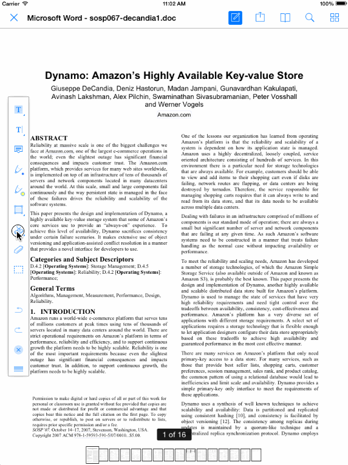
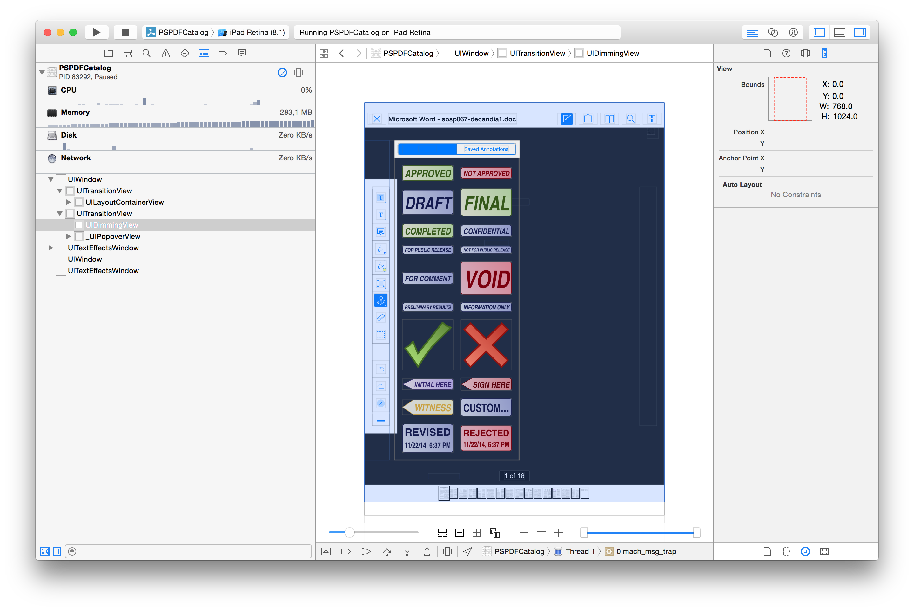
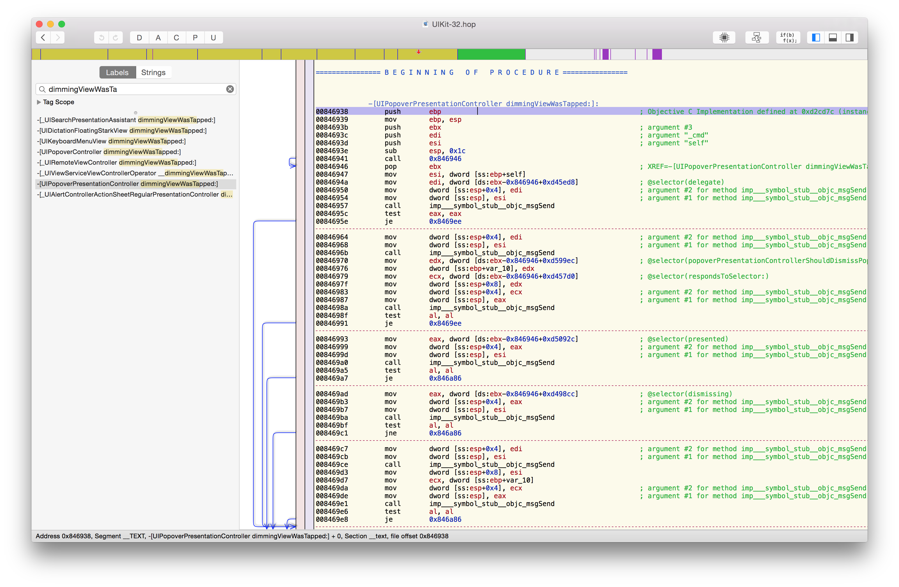
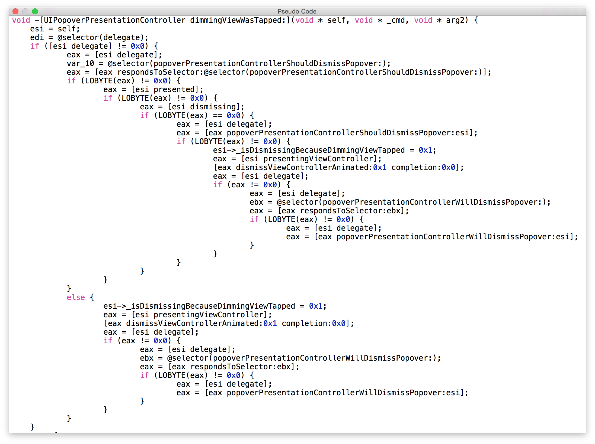

# 调试：案例学习

没人写的代码是完美无暇的，但调试代码我们却都应该有能力能做好。相比提供一个关于本话题的随机小建议，我更倾向于选择带你亲身经历一个 bug 修复的过程，这是一个 UIKit 的 bug，我会展示我用来理解，隔离，并最终解决这个问题的流程。

## 问题

我收到了一个 bug 反馈报告，当快速点击一个按钮来弹出一个 popover 并 dismiss 它的同时，**父**视图控制器也会被 dismiss。谢天谢地，还附上了一个截图示意，所以第一步 -- 重现 bug -- 已经被做到了：



我的第一个猜测是，我们可能包含了 dismiss 视图控制器的代码，我们错误地 dismiss 了父视图控制器。然而，当使用 Xcode 集成的视图调试功能时，很明显有一个全局 `UIDimmingView` 作为 first responder 来响应点击事件：



苹果在 Xcode 6 中添加了[调试视图层次结构](https://developer.apple.com/library/ios/recipes/xcode_help-debugger/using_view_debugger/using_view_debugger.html)的功能，这一举动很可能是受到非常受欢迎的应用 [Reveal](http://revealapp.com/) 和 [Spark Inspector](http://sparkinspector.com/) 的启发。相对于 Xcode，它们在许多方面表现更好，功能更多。

## 使用 LLDB

在可视化调试出现之前，最常见的做法是在 LLDB 使用 `po [[UIWindow keyWindow] recursiveDescription]` 来检查层次结构。它可以以文本形式打印出[完整的视图层次结构](https://gist.github.com/steipete/5a3c7a3b6e80d2b50c3b)。

类似于检查视图层次，我们也可以用 `po [[[UIWindow keyWindow] rootViewController] _printHierarchy]` 来检查视图控制器。这是一个苹果默默在  iOS 8 中为 `UIViewController` 添加的[私有辅助方法](https://github.com/nst/iOS-Runtime-Headers/blob/a8f9f7eb4882c9dfc87166d876c547b75a24c5bb/Frameworks/UIKit.framework/UIViewController.h#L365) 。

```
(lldb) po [[[UIWindow keyWindow] rootViewController] _printHierarchy]
<PSPDFNavigationController 0x7d025000>, state: disappeared, view: <UILayoutContainerView 0x7b3218d0> not in the window
   | <PSCatalogViewController 0x7b3100d0>, state: disappeared, view: <UITableView 0x7c878800> not in the window
   + <UINavigationController 0x8012c5d0>, state: appeared, view: <UILayoutContainerView 0x8012b7a0>, presented with: <_UIFullscreenPresentationController 0x80116c00>
   |    | <PSPDFViewController 0x7d05ae00>, state: appeared, view: <PSPDFViewControllerView 0x80129640>
   |    |    | <PSPDFContinuousScrollViewController 0x7defa8e0>, state: appeared, view: <UIView 0x7def1ce0>
   |    + <PSPDFNavigationController 0x7d21a800>, state: appeared, view: <UILayoutContainerView 0x8017b490>, presented with: <UIPopoverPresentationController 0x7f598c60>
   |    |    | <PSPDFContainerViewController 0x8017ac40>, state: appeared, view: <UIView 0x7f5a1380>
   |    |    |    | <PSPDFStampViewController 0x8016b6e0>, state: appeared, view: <UIView 0x7f3dbb90>
```

LLDB 非常强大并且可以脚本化。 Facebook 发布了一组名为 [Chisel 的 Python 脚本集合](https://github.com/facebook/chisel) 为日常调试提供了非常多的帮助。`pviews` 和 `pvc` 等价于视图和视图控制器的层次打印。Chisel 的视图控制器树和上面方法打印的很类似，但是同时还显示了视图的尺寸。
我通常用它来检查[响应链](https://developer.apple.com/library/ios/documentation/EventHandling/Conceptual/EventHandlingiPhoneOS/event_delivery_responder_chain/event_delivery_responder_chain.html)，虽然你可以对你感兴趣的对象手动循环执行 `nextResponder`，或者[添加一个类别辅助方法](https://gist.github.com/n-b/5420684)，但输入 `presponder object` 依旧是迄今为止最快的方法。

## 添加断点

我们首先要找出实际 dismiss 我们视图控制器的代码。最容易想到的是在 `viewWillDisappear:` 设置一个断点来进行调用栈跟踪：

```
(lldb) bt
* thread #1: tid = 0x1039b3, 0x004fab75 PSPDFCatalog`-[PSPDFViewController viewWillDisappear:](self=0x7f354400, _cmd=0x03b817bf, animated='\x01') + 85 at PSPDFViewController.m:359, queue = 'com.apple.main-thread', stop reason = breakpoint 1.1
  * frame #0: 0x004fab75 PSPDFCatalog`-[PSPDFViewController viewWillDisappear:](self=0x7f354400, _cmd=0x03b817bf, animated='\x01') + 85 at PSPDFViewController.m:359
    frame #1: 0x033ac782 UIKit`-[UIViewController _setViewAppearState:isAnimating:] + 706
    frame #2: 0x033acdf4 UIKit`-[UIViewController __viewWillDisappear:] + 106
    frame #3: 0x033d9a62 UIKit`-[UINavigationController viewWillDisappear:] + 115
    frame #4: 0x033ac782 UIKit`-[UIViewController _setViewAppearState:isAnimating:] + 706
    frame #5: 0x033acdf4 UIKit`-[UIViewController __viewWillDisappear:] + 106
    frame #6: 0x033c46a1 UIKit`-[UIViewController(UIContainerViewControllerProtectedMethods) beginAppearanceTransition:animated:] + 200
    frame #7: 0x03380ad8 UIKit`__56-[UIPresentationController runTransitionForCurrentState]_block_invoke + 594
    frame #8: 0x033b47ab UIKit`__40+[UIViewController _scheduleTransition:]_block_invoke + 18
    frame #9: 0x0327a0ce UIKit`___afterCACommitHandler_block_invoke + 15
    frame #10: 0x0327a079 UIKit`_applyBlockToCFArrayCopiedToStack + 415
    frame #11: 0x03279e8e UIKit`_afterCACommitHandler + 545
    frame #12: 0x060669de CoreFoundation`__CFRUNLOOP_IS_CALLING_OUT_TO_AN_OBSERVER_CALLBACK_FUNCTION__ + 30
    frame #20: 0x032508b6 UIKit`UIApplicationMain + 1526
    frame #21: 0x000a119d PSPDFCatalog`main(argc=1, argv=0xbffcd65c) + 141 at main.m:15
(lldb) 
```

利用 LLDB 的 `bt` 命令，你可以打印断点。`bt all` 可以达到一样的效果，区别在于会打印全部线程的状态，而不仅是当前的线程。

看看这个栈，我们注意到视图控制器已经被 dismiss 途中，因为这个方法是在预定的动画中被调用的，所以我们需要在更早的地方增加断点。在这个例子中，我们关注的是对于 `-[UIViewController dismissViewControllerAnimated:completion:]` 的调用。我们在 Xcode 的断点列表中添加一个**符号断点**，并且重新执行示例代码。

Xcode 的断点接口非常强大，它允许你添加[条件，跳过计数，或者自定义动作，比如添加音效和自动继续等](http://www.peterfriese.de/debugging-tips-for-ios-developers/)。虽然它们可以节省相当多的时间，但在这里我们不需要这些特性：

```
(lldb) bt
* thread #1: tid = 0x1039b3, 0x033bb685 UIKit`-[UIViewController dismissViewControllerAnimated:completion:], queue = 'com.apple.main-thread', stop reason = breakpoint 7.1
  * frame #0: 0x033bb685 UIKit`-[UIViewController dismissViewControllerAnimated:completion:]
    frame #1: 0x03a7da2c UIKit`-[UIPopoverPresentationController dimmingViewWasTapped:] + 244
    frame #2: 0x036153ed UIKit`-[UIDimmingView handleSingleTap:] + 118
    frame #3: 0x03691287 UIKit`_UIGestureRecognizerSendActions + 327
    frame #4: 0x0368fb04 UIKit`-[UIGestureRecognizer _updateGestureWithEvent:buttonEvent:] + 561
    frame #5: 0x03691b4d UIKit`-[UIGestureRecognizer _delayedUpdateGesture] + 60
    frame #6: 0x036954ca UIKit`___UIGestureRecognizerUpdate_block_invoke661 + 57
    frame #7: 0x0369538d UIKit`_UIGestureRecognizerRemoveObjectsFromArrayAndApplyBlocks + 317
    frame #8: 0x03689296 UIKit`_UIGestureRecognizerUpdate + 3720
    frame #9: 0x032a226b UIKit`-[UIWindow _sendGesturesForEvent:] + 1356
    frame #10: 0x032a30cf UIKit`-[UIWindow sendEvent:] + 769
    frame #21: 0x032508b6 UIKit`UIApplicationMain + 1526
    frame #22: 0x000a119d PSPDFCatalog`main(argc=1, argv=0xbffcd65c) + 141 at main.m:15
```

如我们所说！正如预期的，全屏 `UIDimmingView` 接收到我们的触摸并且在 `handleSingleTap:` 中处理，接着转发到 `UIPopoverPresentationController` 中的 `dimmingViewWasTapped:` 方法来 dismiss 视图控制器 (就像它该做的那样)，然而。当我们快速点击时，这个断点被调用了两次。这里有第二个 dimming 视图？还是说调用的是相同的实例？我们只有断点时候的程序集，所以调用 `po self` 是无效的。

## 调用约定入门

根据程序集和函数调用约定的一些基本知识，我们依然可以拿到 `self` 的值。[iOS ABI Function Call Guide](http://developer.apple.com/library/ios/#documentation/Xcode/Conceptual/iPhoneOSABIReference/Introduction/Introduction.html) 和在 iOS 模拟器时使用的 [Mac OS X ABI Function Call Guide](http://developer.apple.com/library/mac/#documentation/DeveloperTools/Conceptual/LowLevelABI/000-Introduction/introduction.html) 都是极好的资源。

我们知道每个 Objective-C 方法都有两个隐式参数：`self` 和 `_cmd`。于是我们所需要的就是在栈上的第一个对象。在 **32-bit** 架构中，栈信息保存在 `$esp` 里，所以在 Objective-C 方法中你可以你可以使用 `po *(int*)($esp+4)` 来获取 `self`，以及使用 `p (SEL)*(int*)($esp+8)` 来获取 `_cmd`。`$esp` 里的第一个值是返回地址。随后的变量保存在 `$esp+12`，`$esp+16` 以及依此类推的其他位置上。

**x86-64** 架构 (那些包含 arm64 芯片 iPhone 设备的模拟器) 提供了更多寄存器，所以变量放置在 `$rdi`，`$rsi`，`$rdx`，`$rcx`，`$r8`，`$r9` 中。所有后续的变量在 `$rbp` 栈上。开始于 `$rbp+16`，`$rbp+24` 等。

**armv7** 架构的变量通常放置在 `$r0`，`$r1`，`$r2`，`$r3` 中，接着移动到 `$sp` 栈上：

```
(lldb) po $r0
<PSPDFViewController: 0x15a1ca00 document:<PSPDFDocument 0x15616e70 UID:amazondynamososp2007_0c7fb1fc6c0841562b090b94f0c1c890 files:1 pageCount:16 isValid:1> page:0>

(lldb) p (SEL)$r1
(SEL) $1 = "dismissViewControllerAnimated:completion:"
```

**arm64** 类似于 armv7，然而，因为有更多的寄存器，从 `$x0` 到 `$x7` 的整个范围都用来存放变量，之后回到栈寄存器 `$sp` 中。

你可以学到更多关于 [x86](http://eli.thegreenplace.net/2011/02/04/where-the-top-of-the-stack-is-on-x86/)，[x86-64](http://eli.thegreenplace.net/2011/09/06/stack-frame-layout-on-x86-64/) 的栈布局知识，还可以阅读 [AMD64 ABI Draft](http://www.x86-64.org/documentation/abi.pdf) 来进行深入。

## 使用 Runtime

跟踪方法执行的另一种做法是重写方法，并在调用父类之前加入日志输出。然而，手动 swizzling 调试起来虽然方便，但是在要花的时间上来说其实效率不高。在前一阵子，我写了一个很小的叫做 [*Aspects*](http://github.com/steipete/Aspects) 的库，来专门做这件事情。它可以用于生产代码，但是我大部分时候只用它来调试和写测试用例。(如果你对 Aspects 感兴趣，你可以[在这里了解更多相关知识。](https://speakerdeck.com/steipete/building-aspects))

```
#import "Aspects.h"

[UIPopoverPresentationController aspect_hookSelector:NSSelectorFromString(@"dimmingViewWasTapped:") 
                                         withOptions:0 
                                          usingBlock:^(id <AspectInfo> info, UIView *tappedView) {
    NSLog(@"%@ dimmingViewWasTapped:%@", info.instance, tappedView);
} error:NULL];
```

这里我们为 `dimmingViewWasTapped:` 添加了一个钩子，它是私有方法 — 因此我们使用 `NSSelectorFromString`。你可以验证方法是否存在，并通过使用 [iOS Runtime Headers](https://github.com/nst/iOS-Runtime-Headers) 来查找几乎每个框架类的其他私有和公共方法。这个项目利用了不可能在运行时真正地隐藏方法这一事实，它在所有类中查找方法并，从而创建了一个比苹果所提供给我们的相比，更完整的头文件。(当然，调用私有 API 并不是一个好主意 — 这里只是用来便于理解到底发生了什么)

在钩子方法的日志中，我们获得如下输出：

```
PSPDFCatalog[84049:1079574] <UIPopoverPresentationController: 0x7fd09f91c530> dimmingViewWasTapped:<UIDimmingView: 0x7fd09f92f800; frame = (0 0; 768 1024)>
PSPDFCatalog[84049:1079574] <UIPopoverPresentationController: 0x7fd09f91c530> dimmingViewWasTapped:<UIDimmingView: 0x7fd09f92f800; frame = (0 0; 768 1024)>
```

我们看到对象地址完全相同，所以我们可怜的 dimming 视图真的被调用了两次，我们可以使用 Aspects 来查看具体 dismiss 方法调用在了哪个控制器上：

```
[UIViewController aspect_hookSelector:@selector(dismissViewControllerAnimated:completion:)
                          withOptions:0
                           usingBlock:^(id <AspectInfo> info) {
    NSLog(@"%@ dismissed.", info.instance);
} error:NULL];
```

```
2014-11-22 19:24:51.900 PSPDFCatalog[84210:1084883] <UINavigationController: 0x7fd673789da0> dismissed.
2014-11-22 19:24:52.209 PSPDFCatalog[84210:1084883] <UINavigationController: 0x7fd673789da0> dismissed.
```

两次 dimming 视图都调用了主导航控制器的 dismiss 方法。如果子视图控制器存在的话，视图控制器的 `dismissViewControllerAnimated:completion:` 会将视图控制器的 dismiss 请求转发到它的子视图控制器中，否则它将 dismiss 自己。所以第一次 dismiss 请求执行于 popover，而第二次，导航控制器本身被 dismiss 了。

## 查找临时方案

现在我们知道发生了什么事情 — 接下来我们可以进入**为何发生**的环节。UIKit 是闭源代码，但是我们使用像 [Hopper](http://www.hopperapp.com/) 这样的反汇编工具来解读 UIKit 程序集并且仔细看看 `UIPopoverPresentationController` 里发生了什么事情。你可以在 `/Applications/Xcode.app/Contents/Developer/Platforms/iPhoneSimulator.platform/Developer/SDKs/iPhoneSimulator.sdk/System/Library/Frameworks/UIKit.framework` 里找到二进制文件。然后在 Hopper 里使用 File -> Read Executable to Disassemble...，这将遍历整个二进制文件并且将代码符号化。32-bit 反汇编是最成熟的一个。所以你选择 32-bit 文件可以拿到最好的结果。[Hex-Rays 出品的 IDA](https://www.hex-rays.com/products/ida/) 是另一个很强大很昂贵的反汇编程序，通常可以提供[更好的结果](https://twitter.com/steipete/status/537565877332639744):



一些汇编语言的基础知识对阅读代码会非常有用。不过，你也可以使用伪代码视图来得到类似于 C 代码的结果：



阅读伪代码结果让人大开眼界。这里有两个代码路径 — 其中一个是如果 delegate 实现了 `popoverPresentationControllerShouldDismissPopover:` 时调用，另一个在没有实现时调用 — 两个代码路径实际上相当不同。delegate 实现了委托方法的那个路径中，包含了 `if (controller.presented && !controller.dismissing)`，而另一个代码路径 (我们现在实际进入的) 却没有，并总是调用 dismiss。通过内部信息，我们可以尝试通过实现我们自己的 `UIPopoverPresentationControllerDelegate` 来绕开这个 bug：

```
- (BOOL)popoverPresentationControllerShouldDismissPopover:(UIPopoverPresentationController *)popoverPresentationController {
    return YES;
}
```

我的第一次尝试是把创建 popover 的主视图控制器设为 delegate。然而它破坏了 `UIPopoverController`。虽然文档没提，但 popover 控制器会在 `_setupPresentationController` 中将自己设为 delegate，另外，移除这个 delegate 将造成破坏。之后，我使用了一个 `UIPopoverController` 的子类并直接添加了上面的方法。这两个类之间的联系并没有文档化，而且我们的解决方案依赖于这个没有文档的行为；不过，这个实现是匹配默认行为的，它纯粹是为了解决这个问题，所以它是经得起未来考验的代码。

## 反馈 Radar

现在请不要停下。我们通常需要为这样的绕开问题的方案写一些文档，但还有一件重要的事情是，给 Apple 提交一个 radar。这么做会带来额外的好处，这能让你验证你是否真正理解这个 bug，并且在你的程序中没有其他副作用 — 如果你之后放弃支持这个 iOS 版本，你可以很容易回滚代码并测试这个 radar 是否修正过。

```
// UIPopoverController 是它的 contentViewController，即 UIPopoverPresentationController 的默认的 delegate
//
// 这里有一个 bug：当双击 diming 视图时，presentation 视图控制器将调用两次
// dismissViewControllerAnimated:completion:，并 dismiss 掉它的父控制器.
//
// 通过实现这个 delegate 可以让代码运行另一条正确地检查了是否正在 dismiss 的代码路径
// rdar://problem/19067761
- (BOOL)popoverPresentationControllerShouldDismissPopover:(UIPopoverPresentationController *)popoverPresentationController {
    return YES;
}
```

写一个 Radar 实际上是非常有趣的挑战，它并不像你想象的那么花时间。用一个示例，你将帮助那些劳累苹果工程师，没有示例，工程师将很有可能推迟，甚至不考虑这个 radar。我为这个问题创建了一个大约 50 行代码的例子，还包括一些意见和解决方案。单视图的模板通常是创建一个示例的最快方式。

现在，我们都知道苹果的 Radar 网页并没有那么好用，不过你可以不使用它。[QuickRadar](http://www.quickradar.com/) 是一个用来提交 radar 的非常优秀的 Mac 前端，同时它会自动提交一个副本到 [OpenRadar](http://openradar.appspot.com)。此外，复制 radar 也极其方便。你应该马上下载它，另外，如果你觉得例子里这样的错误值得被修复，可以复制 rdar://19067761。

并不是所有问题都可以用一些简单的方案绕开，但这些步骤将帮助你找到更好的解决问题的方法，或者至少帮助你的理解为什么某些事情会发生。

## 参考

*  [iOS Debugging Magic (TN2239)](https://developer.apple.com/library/ios/technotes/tn2239/_index.html)
*  [iOS Runtime Headers](https://github.com/nst/iOS-Runtime-Headers)
*  [Debugging Tips for iOS Developers](http://www.peterfriese.de/debugging-tips-for-ios-developers/)
*  [Hopper — a reverse engineering tool](http://www.hopperapp.com/)
*  [IDA by Hex-Rays](https://www.hex-rays.com/products/ida/)
*  [Aspects — Delightful, simple library for aspect-oriented programming.](http://github.com/steipete/Aspects)
*  [Building Aspects](https://speakerdeck.com/steipete/building-aspects)
*  [Event Delivery: The Responder Chain](https://developer.apple.com/library/ios/documentation/EventHandling/Conceptual/EventHandlingiPhoneOS/event_delivery_responder_chain/event_delivery_responder_chain.html)
*  [Chisel — a collection of LLDB commands to assist debugging iOS apps](https://github.com/facebook/chisel)
*  [Where the top of the stack is on x86](http://eli.thegreenplace.net/2011/02/04/where-the-top-of-the-stack-is-on-x86/)
*  [Stack frame layout on x86-64](http://eli.thegreenplace.net/2011/09/06/stack-frame-layout-on-x86-64)
*  [AMD64 ABI draft](http://www.x86-64.org/documentation/abi.pdf)
*  [ARM 64-bit Architecture](http://infocenter.arm.com/help/topic/com.arm.doc.ihi0055b/IHI0055B_aapcs64.pdf)
*  [Decompiling assembly: IDA vs Hopper](https://twitter.com/steipete/status/537565877332639744)
