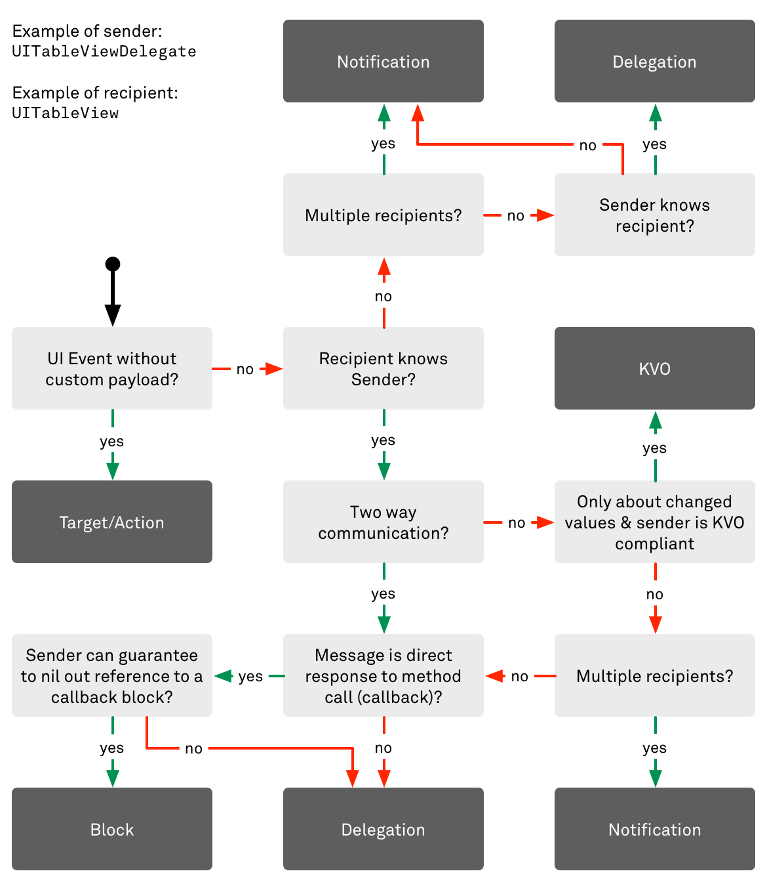
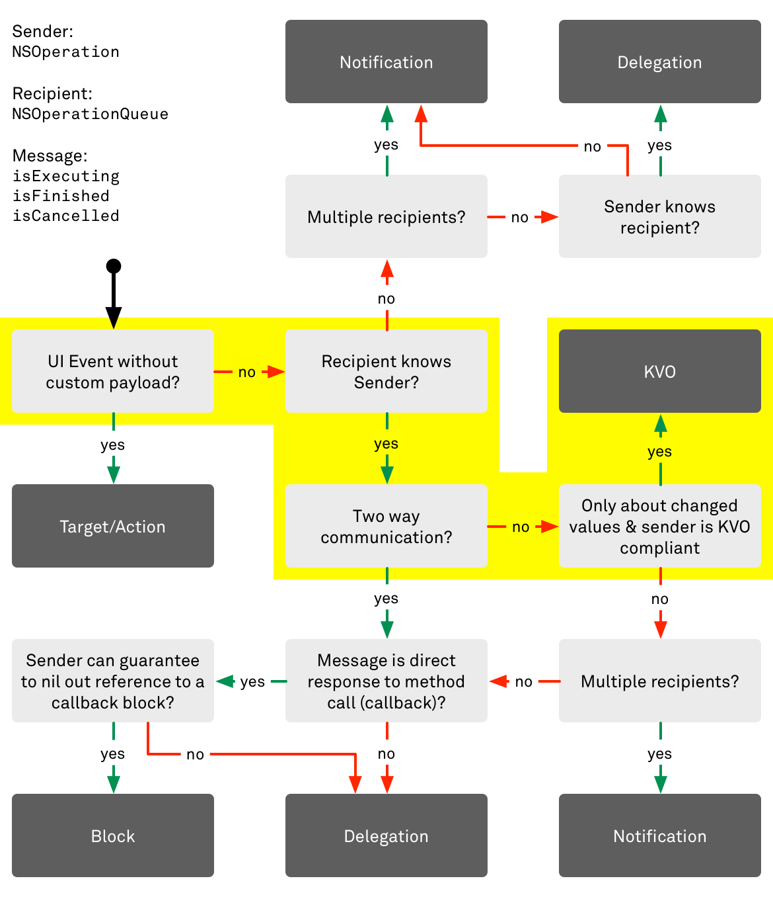
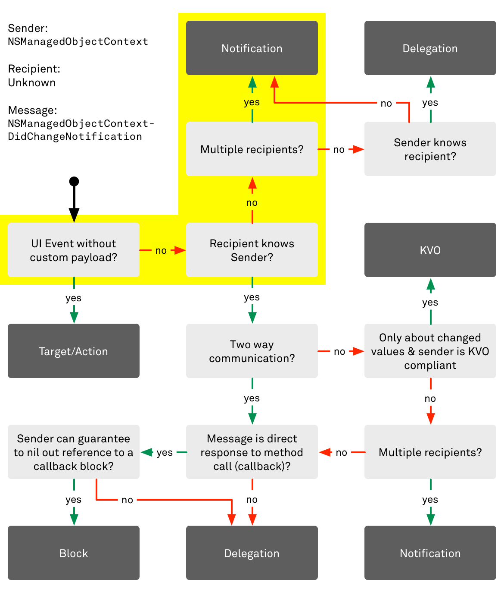
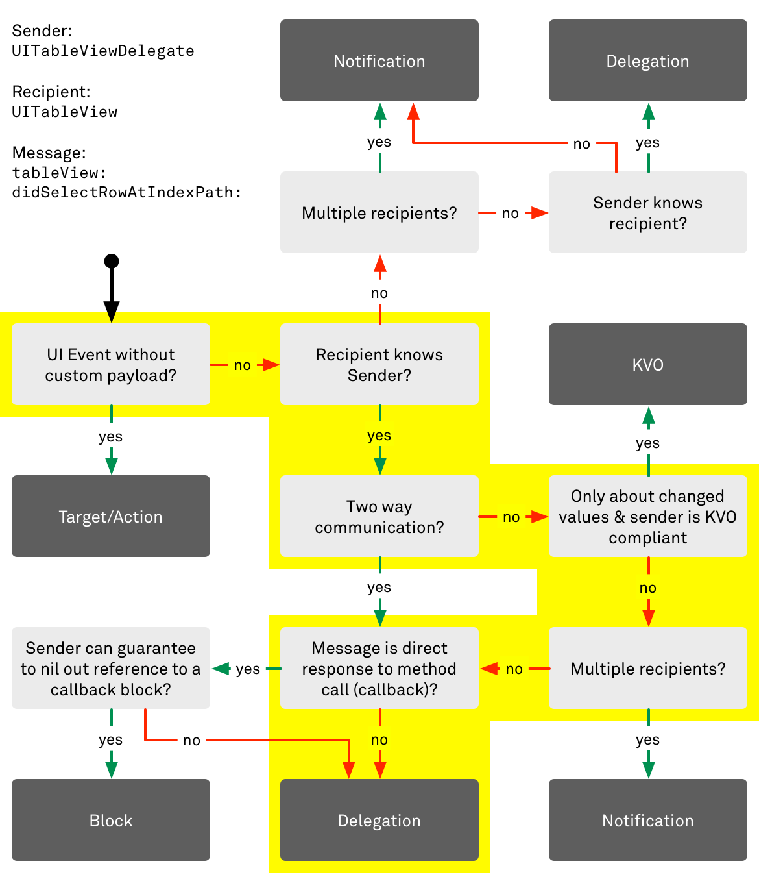
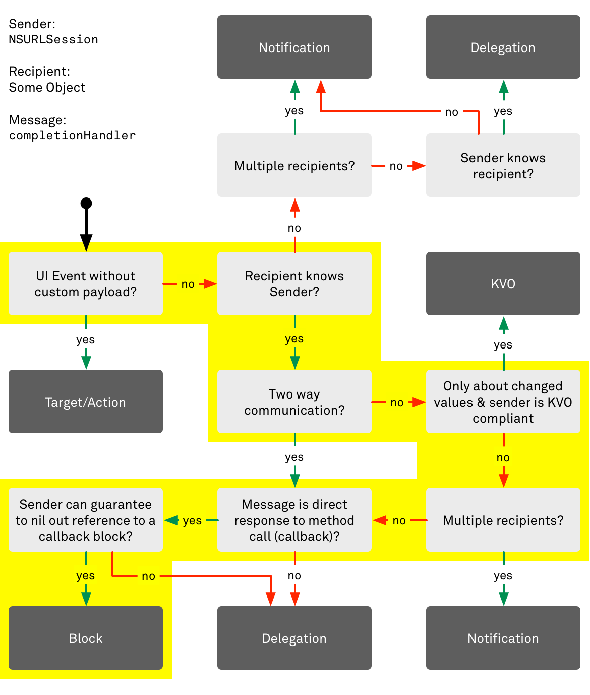

# 消息传递机制

每个应用或多或少都由一些需要相互传递消息的对象结合起来以完成任务。在这篇文章里，我们将介绍所有可用的消息传递机制，并通过例子来介绍怎样在苹果的框架里使用。我们还会选择一些最佳范例来介绍什么时候该用什么机制。

虽然这一期的主题是关于 Foundation 框架的，但是我们会超出 Foundation 的消息传递机制 (KVO 和 通知) 来讲一讲 delegation，block 和 target-action 几种机制。

当然，有些情况下该使用什么机制没有唯一的答案，所以应该按照自己的喜好去试试。另外大多数情况下该使用什么机制应该是很清楚的。

本文中，我们会常常提及“接收者”和“发送者”。它们在消息传递中的意思可以通过以下的例子解释：一个 table view 是发送者，它的 delegate 就是接收者。Core Data managed object context 是它所发出的 notification 的发送者，获取 notification 的就是接收者。一个滑块 (slider) 是 action 消息的发送者，而实现这个 action （方法）的是它的接收者。任何修改一个支持 KVO 的对象的对象是发送者，这个 KVO 对象的观察者就是接收者。明白精髓了吗？

## 几种消息传递机制

首先我们来看看每种机制的具体特点。在这个基础上，下一节我们会画一个流程图来帮我们在具体情况下正确选择应该使用的机制。最后，我们会介绍一些苹果框架里的例子并且解释为什么在那些用例中会选择这样的机制。

### KVO

KVO 是提供对象属性被改变时的通知的机制。KVO 的实现在 Foundation 中，很多基于 Foundation 的框架都依赖它。想要了解更多有关 KVO 的最佳实践，请阅读本期 Daniel 写的 [KVO 和 KVC 文章](http://objccn.io/issue-7-3)。

如果只对某个对象的值的改变感兴趣的话，就可以使用 KVO 消息传递。不过有一些前提：第一，接收者（接收对象改变的通知的对象）需要知道发送者 （值会改变的对象）；第二，接收者需要知道发送者的生命周期，因为它需要在发送者被销毁前注销观察者身份。如果这两个要去符合的话，这个消息传递机制可以一对多（多个观察者可以注册观察同一个对象的变化）

如果要在 Core Data 上使用 KVO 的话，方法会有些许差别。这和 Core Data 的惰性加载 (faulting) 机制有关。一旦一个 managed object 被惰性加载处理的话，即使它的属性没有被改变，它还是会触发相应的观察者。

> 
编者注 把属性值先取入缓存中，在对象需要的时候再进行一次访问，这在 Core Data 中是默认行为，这种技术称为 Faulting。这么做可以避免降低内存开销，但是如果你确定将访问结果对象的具体属性值时，可以禁用 Faults 以提高获取性能。关于这个技术更多的情况，请移步[官方文档](https://developer.apple.com/library/ios/documentation/Cocoa/Conceptual/CoreData/Articles/cdFaultingUniquing.html)

### 通知

要在代码中的两个不相关的模块中传递消息时，通知机制是非常好的工具。通知机制广播消息，当消息内容丰富而且无需指望接收者一定要关注的话这一招特别有用。

通知可以用来发送任意消息，甚至可以包含一个 `userInfo` 字典。你也可以继承 `NSNotification` 写一个自己的通知类来自定义行为。通知的独特之处在于，发送者和接收者不需要相互知道对方，所以通知可以被用来在不同的相隔很远的模块之间传递消息。这就意味着这种消息传递是单向的，我们不能回复一个通知。

### 委托 (Delegation)

Delegation 在苹果的框架中广泛存在。它让我们能自定义对象的行为，并收到一些触发的事件。要使用 delegation 模式的话，发送者需要知道接收者，但是反过来没有要求。因为发送者只需要知道接收者符合一定的协议，所以它们两者结合的很松。

因为 delegate 协议可以定义任何的方法，我们可以照着自己的需求来传递消息。可以用方法参数来传递消息内容，delegate 可以通过返回值的形式来给发送者作出回应。如果只要在相对接近的两个模块间传递消息，delgation 是很灵活很直接的消息传递机制。

过度使用 delegation 也会带来风险。如果两个对象结合得很紧密，任何其中一个对象都不能单独运转，那么就不需要用 delegate 协议了。这些情况下，对象已经知道各自的类型，可以直接交流。两个比较新的例子是 `UICollectionViewLayout` 和 `NSURLSessionConfiguration`。

### Block

Block 是最近才加入 Objective-C 的，首次出现在 OS X 10.6 和 iOS 4 平台上。Block 通常可以完全替代 delegation 消息传递机制的角色。不过这两种机制都有它们自己的独特需求和优势。

一个不使用 block 的理由通常是 block 会存在导致 retain 环 ([retain cycles](https://developer.apple.com/library/mac/documentation/cocoa/conceptual/memorymgmt/Articles/mmPractical.html#//apple_ref/doc/uid/TP40004447-1000810)) 的风险。如果发送者需要 retain block 但又不能确保引用在什么时候被赋值为 `nil`， 那么所有在 block 内对 `self` 的引用就会发生潜在的 retain 环。

假设我们要实现一个用 block 回调而不是 delegate 机制的 table view 里的选择方法，如下所示：

    self.myTableView.selectionHandler = ^void(NSIndexPath *selectedIndexPath) {
        // 处理选择
    };

这儿的问题是，`self` 会 retain table view，table view 为了让 block 之后可以使用而又需要 retain 这个 block。然而 table view 不能把这个引用设为 nil，因为它不知道什么时候不需要这个 block 了。如果我们不能保证打破 retain 环并且我们需要 retain 发送者，那么 block 就不是一个的好选择。

`NSOperation` 是使用 block 的一个好范例。因为它在一定的地方打破了 retain 环，解决了上述的问题。

    self.queue = [[NSOperationQueue alloc] init];
    MyOperation *operation = [[MyOperation alloc] init];
    operation.completionBlock = ^{
        [self finishedOperation];
    };
    [self.queue addOperation:operation];

一眼看来好像上面的代码有一个 retain 环：`self` retain 了 queue，queue retain 了 operation， operation retain 了 completionBlock， 而 completionBlock retain 了 `self`。然而，把 operation 加入 queue 中会使 operation 在某个时间被执行，然后被从 queue 中移除。（如果没被执行，问题就大了。）一旦 queue 把 operation 移除，retain 环就被打破了。

另一个例子是：我们在写一个视频编码器的类，在类里面我们会调用一个 `encodeWithCompletionHandler:` 的方法。为了不出问题，我们需要保证编码器对象在某个时间点会释放对 block 的引用。其代码如下所示：

    @interface Encoder ()
    @property (nonatomic, copy) void (^completionHandler)();
    @end

    @implementation Encoder

    - (void)encodeWithCompletionHandler:(void (^)())handler
    {
        self.completionHandler = handler;
        // 进行异步处理...
    }

    // 这个方法会在完成后被调用一次
    - (void)finishedEncoding
    {
        self.completionHandler();
        self.completionHandler = nil; // <- 不要忘了这个!
    }

    @end

一旦任务完成，completion block 调用过了以后，我们就应该把它设为 `nil`。

如果一个被调用的方法需要发送一个一次性的消息作为回复，那么使用 block 是很好的选择， 因为这样做我们可以打破潜在的 retain 环。另外，如果将处理的消息和对消息的调用放在一起可以增强可读性的话，我们也很难拒绝使用 block 来进行处理。在用例之中，使用 block 来做完成的回调，错误的回调，或者类似的事情，是很常见的情况。

### Target-Action

Target-Action 是回应 UI 事件时典型的消息传递方式。iOS 上的 `UIControl` 和 Mac 上的 `NSControl`/`NSCell` 都支持这个机制。Target-Action 在消息的发送者和接收者之间建立了一个松散的关系。消息的接收者不知道发送者，甚至消息的发送者也不知道消息的接收者会是什么。如果 target 是 `nil`，action 会在[响应链 (responder chain)](https://developer.apple.com/library/ios/documentation/general/conceptual/Devpedia-CocoaApp/Responder.html) 中被传递下去，直到找到一个响应它的对象。在 iOS 中，每个控件甚至可以和多个 target-action 关联。

基于 target-action 传递机制的一个局限是，发送的消息不能携带自定义的信息。在 Mac 平台上 action 方法的第一个参数永远接收者。iOS 中，可以选择性的把发送者和触发 action 的事件作为参数。除此之外就没有别的控制 action 消息内容的方法了。

## 做出正确的选择

基于上述对不同消息传递机制的特点，我们画了一个流程图来帮助我们在不同情境下做出不同的选择。一句忠告：流程图的建议不代表最终答案。有些时候别的选择依然能达到应有的效果。只不过大多数情况下这张图能引导你做出正确的决定。

图中有些细节值得深究：

有个框中说到： *发送者支持 KVO*。这不仅仅是说发送者会在值改变的时候发送 KVO 通知，而且说明观察者需要知道发送者的生命周期。如果发送者被存在一个 weak 属性中，那么发送者有可能会自己变成 nil，那时观察者会导致内存泄露。

一个在最后一行的框里说，*消息直接响应方法调用*。也就是说方法调用的接收者需要给调用者一个消息作为方法调用的直接反馈。这也就是说处理消息的代码和调用方法的代码必须在同一个地方。

最后在右下角的地方，一个选择分支这样说：*发送者能确保释放对 block 的引用吗？*这涉及到了我们[之前](#block)讨论 block 的 API 存在潜在的 retain 环的问题。如果发送者不能保证在某个时间点会释放对 block 的引用，那么你会惹上 retain 环的麻烦。

## Framework 示例

本节我们通过一些苹果框架里的例子来验证流程图的选择是否有道理，同时解释为什么苹果会选择用这些机制。

### KVO

`NSOperationQueue` 用了 KVO 观察队列中的 operation 状态属性的改变情况 (`isFinished`，`isExecuting`，`isCancelled`)。当状态改变的时候，队列会收到 KVO 通知。为什么 operation 队列要用 KVO 呢？

消息的接收者（operation 队列）知道消息的发送者（operation），并 retain 它并控制后者的生命周期。另外，在这种情况下只需要单向的消息传递机制。当然如果考虑到 oepration 队列只关心那些改变 operation 的值的改变情况的话，就还不足以说服大家使用 KVO 了。但我们可以这么理解：被传递的消息可以被当成值的改变来处理。因为 state 属性在 operation 队列以外也是有用的，所以这里适合用 KVO。

当然 KVO 不是唯一的选择。我们也可以将 operation 队列作为 operation 的 delegate 来使用，operation 会调用类似 `operationDidFinish:` 或者 `operationDidBeginExecuting:` 等方法把它的 state 传递给 queue。这样就不太方便了，因为 operation 要保存 state 属性，以便于调用这些 delegate 方法。另外，由于 queue 不能主动获取 state 信息，所以 queue 也必须保存所有 operation 的 state。

### Notifications

Core Data 使用 notification 传递事件（例如一个 managed object context 中的改变————`NSManagedObjectContextObjectsDidChangeNotification`）

发生改变时触发的 notification 是由 managed object contexts 发出的，所以我们不能假定消息的接收者知道消息的发送者。因为消息的源头不是一个 UI 事件，很多接收者可能在关注着此消息，并且消息传递是单向的，所以 notification 是唯一可行的选择。

### Delegation

Table view 的 delegate 有多重功能，它可以从管理 accessory view，直到追踪在屏幕上显示的 cell。例如我们可以看看 `tableView:didSelectRowAtIndexPath:` 方法。为什么用 delegate 实现而不是 target-action 机制？

正如我们在上述流程图中看到的，用 target-action 时，不能传递自定义的数据。而选中 table view 的某个 cell 时，collection view 不仅需要告诉我们一个 cell 被选中了，也要通过 index path 告诉我们哪个 cell 被选中了。如果我们照着这个思路，流程图会引导我们使用 delegation 机制。

如果不在消息传递中包含选中 cell 的 index path，而是让选中项改变时我们像 table view 主动询问并获取选中 cell 的相关信息，会怎样呢？这会非常不方便，因为我们必须记住当前选中项的数据，这样才能在多选择中知道哪些 cell 是被新选中的。

同理，我们可以想象通过观察 table view 选中项的 index path 属性，当该值发生改变的时候，获得一个选中项改变的通知。不过我们会遇到上述相似问题：不做记录的话我们就不能分辨哪一个 cell 被选择或取消选择了。

### Block

我们用 `-[NSURLSession dataTaskWithURL:completionHandler:]` 来作为一个 block API 的介绍。那么从 URL 加载部分返回给调用者是怎么传递消息的呢？首先，作为 API 的调用者，我们知道消息的发送者，但是我们并没有 retain 它。另外，这是个单向的消息传递————它直接调用 `dataTaskWithURL:` 的方法。如果我们对照流程图，会发现这属于 block 消息传递机制。

有其他的选项吗？当然，苹果自己的 `NSURLConnection` 就是最好的例子。`NSURLConnection`在 block 问世之前就存在了，所以它并没有用 block 来实现消息传递，而是使用 delegation 来完成。当 block 出现以后，苹果就在 OS X 10.7 和 iOS 5 平台上的 `NSURLConnection` 中加了 `sendAsynchronousRequest:queue:completionHandler:`，所以我们不再在简单的任务中使用 delegate 了。

因为 `NSURLSession` 是个最近在 OS X 10.9 和 iOS 7 才出现的 API，所以它们使用 block 来实现消息传递机制（`NSURLSession` 有一个 delegate，但是是用于其他目的）。

### Target-Action

一个明显的 target-action 用例是按钮。按钮在不被按下的时候不需要发送任何的信息。为了这个目的，target-action 是 UI 中消息传递的最佳选择。

如果 target 是明确指定的，那么 action 消息会发送给指定的对象。如果 target 是 `nil`， action 消息会一直在响应链中被传递下去，直到找到一个能处理它的对象。在这种情况下，我们有一个完全解耦的消息传递机制：发送者不需要知道接收者，反之亦然。

Target-action 机制非常适合响应 UI 的事件。没有其他的消息传递机制能够提供相同的功能。虽然 notification 在发送者和接收者的松散关系上最接近它，但是 target-action 可以用于响应链——只有一个对象获得 action 并响应，action 在响应链中传递，直到能遇到响应这个 action 的对象。

## 总结

一开始接触这么多的消息传递机制的时候，我们可能有些无所适从，觉得所有的机制都可以被选用。不过一旦我们仔细分析每个机制的时候，它们各自都有特殊的要求和能力。

文中的选择流程图是帮助你清楚认识这些机制的好的开始，当然它不是所有问题的答案。如果你觉得这和你自己选择机制的方式相似或是有任何缺漏，欢迎来信指正。
