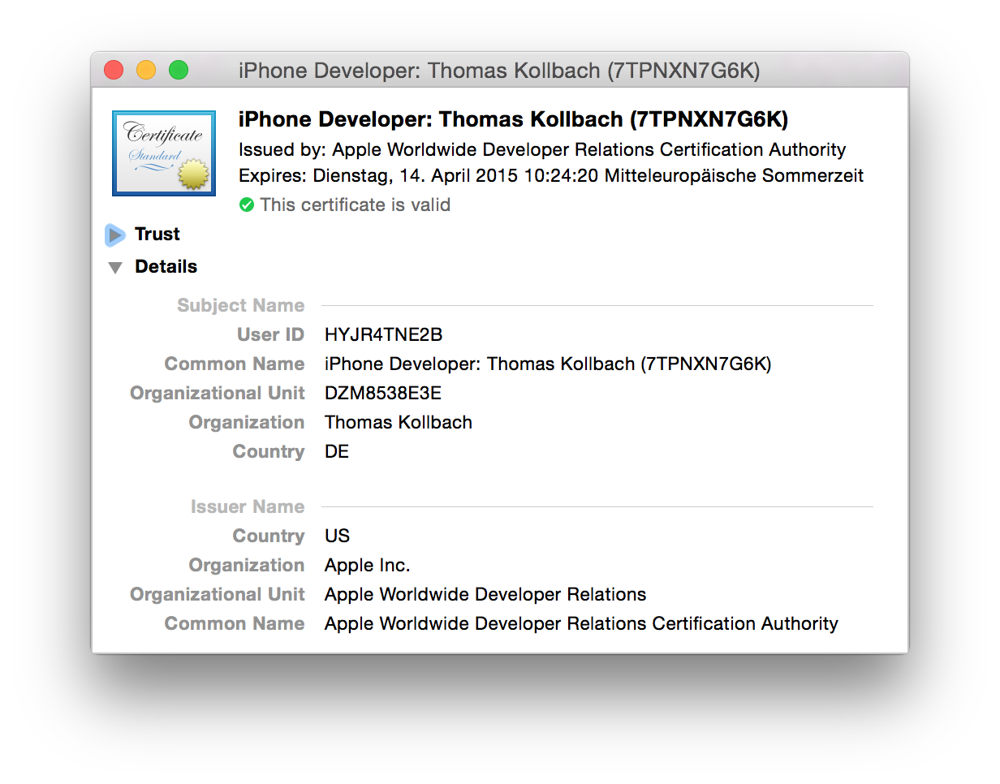

# 代码签名探析

>"用户会感激代码签名带来的好处"
> – Apple Developer Library: [Code Signing Guide](https://developer.apple.com/library/mac/documentation/Security/Conceptual/CodeSigningGuide/Introduction/Introduction.html)

在 iOS 或 OS X 平台上进行应用开发时，你所需要使用的 API 大多设计得简洁明了。你可以轻易地实现[酷炫的动画效果](http://www.objccn.io/issue-12/)，便捷地进行[应用发布前测试](http://www.objccn.io/issue-15)，或是用 [Core Data](http://www.objccn.io/issue-4) 将数据安全的存储在本地。但是总有一天，你会碰上代码签名 (code signing) 和配置文件 (provisioning)，大多数情况下，这会是你在心里问候某些人祖宗的开始。

如果你已经在 iOS 上开发过应用，那么你多半已经与代码签名或设备配置文件打过交道了。即使是 OS X 开发者，如果你想发布自己的应用到 Mac App Store 上去或者想参与苹果的开发者项目，那么也不得不开始为自己的代码进行签名。

大多数时候代码签名看上去像是一个难以理解的神秘黑盒。在这篇文章里我会尽可能揭示盒子内部的运作机理。

通常来说，我们无法直接看到代码签名的运作过程，它们隐藏在 iOS 系统内部和 SDK 之中。但我们可以通过观察设置代码签名所需工具的运作方式，来找出一些线索。除此之外，我们还可以参考 OS X 上的代码签名运作方式，毕竟 iOS 和 OS X 系出同源，我们可以从他们的对比之中得到很多有用的信息。

OS X 上代码签名技术和相应的 API 是在 Mac OS X Leopard 10.5 上首次出现的，这刚好是第一台 iPhone 发布的时候。这并非巧合，因为在 iOS 上，代码签名起到的作用更加重要。iPhone 是在众多游戏主机之后第一个大规模出售并且从头就开始使用代码签名的计算平台。只有在越狱之后，iOS 才能运行没有签名的代码。越狱使应用可以绕过代码签名和沙盒安全机制的全部限制，这会是一个非常危险的行为。

## 证书和密匙

作为一个 iOS 开发者，在你开发使用的机器上应该已经有一个证书，一个公钥，以及一个私钥。这些是代码签名机制的核心。像 SSL 一样，代码签名也依赖于采用 [X.509 标准](http://zh.wikipedia.org/wiki/X.509)的[公开密钥加密](http://zh.wikipedia.org/wiki/%E5%85%AC%E5%BC%80%E5%AF%86%E9%92%A5%E5%8A%A0%E5%AF%86)。

在 OS X 上，X.509 的基本组成部分（译者注：例如证书等）都是由一个叫**钥匙串访问**的工具来进行管理。打开你开发机器上的**钥匙串访问**应用，选择类别选项下的“我的证书（My Certificates）”，你可以看到所有你持有的私钥相对应的证书。要用一个证书设置代码签名，你必须拥有私钥，所以所有你拥有私钥的证书都会被列在这里。如果你拥有一个证书的私钥，你可以展开证书并将它的私钥显示出来：


如果你要导出证书，例如为了备份（强烈建议进行），一定要记得展开证书那一条显示出私钥并将两行都选中。

还有一种可以用来快速地显示出你的系统中能用来对代码进行签名的认证的方法，那就是利用用途广泛的命令行工具 `security`：

```
$ security find-identity -v -p codesigning                       
  1) 01C8E9712E9632E6D84EC533827B4478938A3B15 "iPhone Developer: Thomas Kollbach (7TPNXN7G6K)"
```

概括的讲，一个证书是一个公钥加上许多附加信息，这些附加信息都是被某个认证机构（Certificate Authority 简称 CA）进行签名认证过的，认证这个证书中的信息是准确无误的。对于 iOS 开发来说这个认证机构就是苹果的认证部门 Apple Worldwide Developer Relations CA。认证的签名有固定的有效期，这就意味着当前系统时间需要被正确设置，因为证书是基于当前时间进行核对。这也是为什么将系统时间设定到过去会对 iOS 造成多方面破坏的原因之一。



对于 iOS 开发来说，一般会有两个证书：一个带有前缀 `iPhone Developer`，另一个带有前缀 `iPhone Distribution`。前者用于使应用可以在你的测试设备上运行，后者是在提交应用到 APP store 时用到。一个证书的用途取决于它所包含的内部信息，在钥匙串访问中双击打开一个证书文件，你可以看到许多详细条目，拖动到最下面有一条标记着 `Apple Developer Certificate (Submission)`， 或者 `Apple Developer Certificate (Development)`，具体你会看到哪一种，取决于你所打开的证书是哪一种类型，iOS 系统会利用这个信息来判断你的应用是运行在开发模式下还是发布模式，并据此判断以切换应用运行规则。

为了让拥有公钥的证书起作用，我们需要有私钥。私钥是你在为组成应用的二进制文件进行签名时派上用场的。没有私钥，你就无法用证书和公钥对任何东西设置签名。

签名过程本身是由命令行工具 `codesign` 来完成的。如果你在 Xcode 中编译一个应用，这个应用构建完成之后会自动调用 `codesign` 命令进行签名，`codesign` 也正是给你提供了许多格式友好并且有用错误信息的那一个工具。你可以在 Xcode 的 project settings 中设置代码签名信息。


需要注意的是 Xcode 只允许你在有限的选项中进行选择，这些选项都是你既拥有公钥也拥有私钥的证书。所以如果在选项中没有出现你想要的那一个，那么你需要检查的第一件事情就是你是否拥有这个证书的私钥。在这里你需要区分开用于开发测试还是用于发布，如果你想要在机器上测试你的应用，你需要用用于开发测试的那一对密匙来进行签名，如果你是要发布应用，无论是给测试人员还是发布到 APP Store，你需要用用于发布的那一对密匙来进行签名。

一直以来，以上这些就是代码签名需要设置的全部，设置了这些就几乎完成了。

但是在 Xcode 6 的 project settings 中出现了设置配置文件的选项。如果你选择了某一个配置文件，你必须选择这个配置文件的证书中所包含的公钥所对应的那个密匙对，或者你可以选择让 Xcode 自动完成正确的设置。关于这方面我们稍后再详细说明，首先还是回到代码签名。

## 一个已签名应用的组成

一个已签名的可执行文件的签名包含在 [Mach-O](http://zh.wikipedia.org/wiki/Mach-O) 二进制文件格式中；对于例如脚本这样的非 Mach-O 可执行文件，就存放在该文件系统的的扩展属性中。这种做法使得在 OS X 和 iOS 上的任何可执行二进制文件都可以被设置签名：不论是动态库，命令行工具，还是 .app 后缀的程序包。这也意味着设置签名的过程实际上会改动可执行文件的文件内容，将签名数据写入二进制文件中。

如果你拥有一个证书和它的私钥，那么用 `codesign` 来设置签名非常简单，我们现在尝试用下面列出的这个证书来为 `Example.app` 设置签名：

`$ codesign -s 'iPhone Developer: Thomas Kollbach (7TPNXN7G6K)' Example.app`

如果你想为某一个 app 程序包重新设置签名，那么这个工具就很有用了。为了重新设置签名，你必须带上 `-f` 参数，有了这个参数，`codesign` 会用你选择的签名替换掉已经存在的那一个：

`$ codesign -f -s 'iPhone Developer: Thomas Kollbach (7TPNXN7G6K)' Example.app`

`codesign` 还可以为你提供有关一个可执行文件签名状态的信息，这些信息在出现不明错误时会提供巨大的帮助。举例来说，`$ codesign -vv -d Example.app` 会列出一些有关 `Example.app` 的签名信息：

```
Executable=/Users/toto/Library/Developer/Xcode/DerivedData/Example-cfsbhbvmswdivqhekxfykvkpngkg/Build/Products/Debug-iphoneos/Example.app/Example
Identifier=ch.kollba.example
Format=bundle with Mach-O thin (arm64)
CodeDirectory v=20200 size=26663 flags=0x0(none) hashes=1324+5 location=embedded
Signature size=4336
Authority=iPhone Developer: Thomas Kollbach (7TPNXN7G6K)
Authority=Apple Worldwide Developer Relations Certification Authority
Authority=Apple Root CA
Signed Time=29.09.2014 22:29:07
Info.plist entries=33
TeamIdentifier=DZM8538E3E
Sealed Resources version=2 rules=4 files=120
Internal requirements count=1 size=184
```

你需要查看的第一件事是以 `Authority` 开头的那三行。这三行告诉你到底是哪一个证书为这个 app 设置了签名。在这里当然是我的证书，`iPhone Developer: Thomas Kollbach (7TPNXN7G6K)`。我的这个证书则是被证书 `Apple Worldwide Developer Relations Certification Authority` 设置了签名的，依此类推这个证书则是被证书 `Apple Root CA` 设置了签名。

在 `Format` 中也包含了一些关于代码的信息：`Example.app` 并不单单是一个可执行文件，它是一个程序包，其中包含了一个 `arm64` 二进制文件。从 `Executable` 中的路径信息你可以看出，这是一个以测试为目的的打包，所以是一个 `Mach-O thin` 的二进制文件。

在一堆诊断信息中还包含了两个非常有趣的条目。 `Identifier` 是我在 Xcode 中设置的 bundle identifier。 `TeamIdentifier` 用于标识我的工作组（系统会用这个来判断应用是否是由同一个开发者发布）。此外用于发布应用的证书中也包含这种标识，这种标识在区分同一名称下的不同证书时非常有用。

现在这个二进制文件已经用证书设置好签名。就像中世纪人用蜡来封印信封一样，签名就这样封印了这个应用。下面我们来检查一下封印是否完好：

```
$ codesign --verify Example.app
$ 
```

就像大多数 UNIX 工具一样，没有任何输出代表签名是完好的。那么我下面破坏这个封印，只要修改一下这个二进制文件：

```
$ echo 'lol' >> Example.app/Example
$ codesign --verify Example.app
Example.app: main executable failed strict validation
```

修改已经签名的应用会破坏封印，从命令行输出我们可以看到代码签名正如我们所预期一样起到了作用。

### 程序包和其他资源文件

对于命令行工具和脚本来说，只是一个可执行文件被设置签名，但是 iOS 和 OS X 的应用和框架则是包含了它们所需要的资源在其中的。这些资源包括图片和不同的语言文件，资源中也包括很重要的应用组成部分例如 XIB/NIB 文件，存档文件(archives)，甚至是证书文件。所以为一个程序包设置签名时，这个包中的所有资源文件也都会被设置签名。

为了达到为所有文件设置签名的目的，签名的过程中会在程序包中新建一个叫做 `_CodeSignatue/CodeResources` 的文件，这个文件中存储了被签名的程序包中所有文件的签名。你可以自己去查看这个签名列表文件，它仅仅是一个 plist 格式文件。

这个列表文件中不光包含了文件和它们的签名的列表，还包含了一系列规则，这些规则决定了哪些资源文件应当被设置签名。伴随 OS X 10.10 DP 5 和 10.9.5 版本的发布，苹果改变了代码签名的格式，也改变了有关资源的规则。如果你使用10.9.5或者更高版本的 `codesign` 工具，在 `CodeResources` 文件中会有4个不同区域，其中的 `rules` 和 `files` 是为老版本准备的，而 `files2` 和 `rules2`是为新的第二版的代码签名准备的。最主要的区别是在新版本中你无法再将某些资源文件排除在代码签名之外，在过去你是可以的，只要在被设置签名的程序包中添加一个名为 `ResourceRules.plist` 的文件，这个文件会规定哪些资源文件在检查代码签名是否完好时应该被忽略。但是在新版本的代码签名中，这种做法不再有效。所有的代码文件和资源文件都必须设置签名，不再可以有例外。在新版本的代码签名规定中，一个程序包中的可执行程序包，例如扩展 (extension)，是一个独立的需要设置签名的个体，在检查签名是否完整时应当被单独对待。

## 授权机制 (Entitlements) 和配置文件 (Provisioning)

到目前为止，我们都假设所有的证书起到的作用都是一样的，并且假设如果我们有了一个有效的证书代码签名也就相应的有效。然而这当然不是唯一的规则。操作系统有许多标准来检测你的代码是否允许运行。

这些标准并不是一成不变的。举例来说，在 OS X 上一个应用是否允许被开启是由 Gatekeeper 的选项决定的，你可以在系统设置的安全选项中改变选项。在 Gatekeeper 选项中选择 “受信任的开发者或者来自 Mac App Store” 会要求被打开的应用必须被证书签名，可以是 Mac App Store 开发者的应用发布证书也可以是开发者 ID 证书。这些选项是由一个系统工具 `spctl` 来管理的，它管理着系统的所有安全评估策略。

在 iOS 上规则是不一样的，无论是用户还是开发者都不能改变应用开启策略，你必须有一个开发者帐号或者应用发布证书才能让应用运行在 iOS 系统上。

即使你可以让应用运行起来，在 iOS 上你的应用能做什么依然是受限制的。这些限制是沙盒管理的。沙盒和代码签名机制是不同的，这很重要。代码签名保证了这个应用里所包含的内容正如它所说的那样不多不少，而沙盒则是限制了应用访问系统的资源。这两种技术是相互合作来发挥作用的，它们都能阻止你的应用运行，也都能在 Xcode 中引起奇怪的问题。但是在日常开发过程中，沙盒可能会更经常引起问题。沙盒机制在什么时候会引起问题呢，大多数情况下都是由于一个叫做授权的机制决定的。

### 授权机制

授权机制决定了哪些系统资源在什么情况下允许被一个应用使用。简单的说它就是一个沙盒的配置列表，上面列出了哪些行为被允许，哪些会被拒绝。

很可能你已经猜到授权机制也是按照 plist 文件格式来列出的。Xcode 会将这个文件作为 `--entitlements` 参数的内容传给 `codesign` ，这个文件内部格式如下：

```
<?xml version="1.0" encoding="UTF-8"?>
<!DOCTYPE plist PUBLIC "-//Apple//DTD PLIST 1.0//EN" "http://www.apple.com/DTDs/PropertyList-1.0.dtd">
<plist version="1.0">
<dict>
        <key>application-identifier</key>
        <string>7TPNXN7G6K.ch.kollba.example</string>
        <key>aps-environment</key>
        <string>development</string>
        <key>com.apple.developer.team-identifier</key>
        <string>7TPNXN7G6K</string>
        <key>com.apple.developer.ubiquity-container-identifiers</key>
        <array>
                <string>7TPNXN7G6K.ch.kollba.example</string>
        </array>
        <key>com.apple.developer.ubiquity-kvstore-identifier</key>
        <string>7TPNXN7G6K.ch.kollba.example</string>
        <key>com.apple.security.application-groups</key>
        <array>
                <string>group.ch.kollba.example</string>
        </array>
        <key>get-task-allow</key>
        <true/>
</dict>
</plist>
```

在 Xcode 的 Capabilities 选项卡下选择一些选项之后，Xcode 就会生成这样一段 XML。 Xcode 会自动生成一个 `.entitlements` 文件，然后在需要的时候往里面添加条目。当构建整个应用时，这个文件也会提交给 `codesign` 作为应用所需要拥有哪些授权的参考。这些授权信息必须都在开发者中心的 App ID 中启用，并且包含在配置文件中，稍后我们会详细讨论这一点。在构建应用时需要使用的授权文件可以在 Xcode build setting 中的 code signing entitlements 中设置。

在这个应用中我启用了 iCloud 键值对存储 (key-value storage) (`com.apple.developer.ubiquity-kvstore-identifier`) ，以及 iCloud 文档存储 (`com.apple.developer.ubiquity-container-identifiers`)。另外我还将应用添加进了一个 App Group (比如说为了与扩展 (extensions) 共享数据，`com.apple.security.application-groups`)， 最后开启了推送功能 (`aps-environment`)。这是一个开发版本，我会有将它连接到调试器的需求，这就需要将 `get-task-allow` 设为 `true`。另外，app id，也就是 bundle id 加上开发者 id，也被单独列出来了。

当然你并不能随心所欲的取得授权，你的应用能否得到某一项授权是有特定的规定的。举例来说，当 `get-task-allow` 被设定为 `ture` 时，应用只能在用于开发的证书签名下运行。你被允许使用的推送环境 (aps-environment) 也存在类似的限制。

根据操作系统版本的不同我们可选的授权项目是不一样的，所以很难有一份列表可以详尽地列出所有条目。至少在文档 [Adding Capabilities](https://developer.apple.com/library/mac/documentation/IDEs/Conceptual/AppDistributionGuide/AddingCapabilities/AddingCapabilities.html) 中提到的所有功能都是需要经过授权的。

授权信息会被包含在应用的签名信息中。如果你在这方面遇到了问题，可以尝试查看签名信息中具体包含了什么授权信息：`$ codesign -d --entitlements - Example.app` 会列出一个和前面的很像的 XML 格式的属性列表。你可以将这个文件的内容添加进一个脚本，每次构建应用时用脚本检查是否包含了推送服务的授权信息，以此确保推送服务工作正常。在这里推送服务只是一个例子，你使用的服务越多，这样的时候都添加推送通知的授权，以保证可以注册推送通知。在新版本的 Xcode 6 之后，授权信息列表会以 `Example.app.xcent` 这样的名字的文件形式包含在应用包中。在我看来，这么做是为了在出现配置错误时提供更加有用的错误信息。

### 配置文件

在整个代码签名和沙盒机制中有一个组成部分将签名，授权和沙盒联系了起来，那就是配置文件 (provisioning profiles)。

每一个 iOS 开发者可能都花费过相当的时间研究如何设置配置文件，这个环节也正是会经常出问题的地方。

一个配置文件中存放了系统用于判断你的应用是否允许运行的信息，这就意味着如果你的配置文件有问题，修复起来会相当烦人。

一个配置文件是一组信息的集合，这组信息决定了某一个应用是否能够在某一个特定的设备上运行。配置文件可以用于让应用在你的开发设备上可以被运行和调试，也可以用于内部测试 (ad-hoc) 或者企业级应用的发布。Xcode 会将你在 project setting 中选择的配置文件打包进应用。前面提到了，选择配置文件是 Xcode 6 才提供的功能，在 Xcode 5 或更早版本中，配置文件是 Xcode 根据你选择的签名证书来选择的。事实上同一个证书可以拥有多个不同的配置文件，因此让 Xcode 自行选择可能存在一些不确定性，最好的方式是你自主去选择，在 Xcode 6 中终于提供了这个功能。


我们下面来仔细研究一下配置文件。如果你要在自己的机器上找到配置文件，在这个目录下 `~/Library/MobileDevice/Provisioning Profiles`。Xcode 将从开发者中心下载的全部配置文件都放在了这里。

不要惊讶，配置文件并不是一个 plist 文件，它是一个根据密码讯息语法 (Cryptographic Message Syntax) 加密的文件（下文中会简称 CMS，但不要用这个简写 Google，这不是一个很好的关键字）。如果你处理过 S/MIME 邮件或者证书你会对这种加密比较熟悉，详细信息可以查看互联网工程任务组 (IETF) 制定的 [RFC 3852](http://tools.ietf.org/html/rfc3852)。

采用 CMS 格式进行加密使得配置文件可以被设置签名，所以在苹果给你这个文件之后文件就不能被改变了。配置文件的签名和应用的签名不是一回事，它是由苹果直接在开发者中心 (developer portal) 中设置好了的。

某些版本的 OpenSSL 可以读取这种格式，但是 OS X 自带那个版本并不行。幸运的是命令行工具 `security` 也可以解码这个 CMS 格式，那么我们就用 `security` 来看看一个 `.mobileprovision` 文件内部是什么样子：

`$ security cms -D -i example.mobileprovision`

这个命令会输出签名信息中的内容，如果你亲自试一下，接下来你会得到一个 XML 格式的 plist 文件内容输出。

这个列表中的内容是 iOS 用于判断你的应用是否能运行在某个设备上真正需要的配置信息，每一个配置文件都有它自己的 `UUID` 。Xcode 会用这个 `UUID` 来作为标识，记录你在 build settings 中选择了哪一个配置文件。

首先来看 `DeveloperCertificates` 这项，这一项是一个列表，包含了可以为使用这个配置文件的应用签名的所有证书。如果你用了一个不在这个列表中的证书进行签名，无论这个证书是否有效，这个应用都无法运行。所有的证书都是基于 Base64 编码符合 PEM (Privacy Enhanced Mail, [RFC 1848](http://tools.ietf.org/html/rfc1848)) 格式的。要查看一个证书的详细内容，将编码过的文件内容复制粘贴到一个文件中去，像下面这样：

```
-----BEGIN CERTIFICATE-----
MIIFnjCCBIagAwIBAgIIE/IgVItTuH4wDQYJKoZIhvcNAQEFBQAwgZYxCzA…
-----END CERTIFICATE-----`
```

然后让 OpenSSL 来处理 `openssl x509 -text -in file.pem`。

回到配置文件中继续往下看，你可能会注意到在 `Entitlements` 一项中包含了你的应用的所有授权信息，键值就和之前在授权那节看到的一模一样。

这些授权信息是你在开发者中心下载配置文件时在 App ID 中设置的，理想的情况下，这个文件应该和 Xcode 为应用设置签名时使用的那一个同步，但这种同步并不能得到保证。这个文件的不一致是比较难发现的问题之一。

举例来说，如果你在 Xcode 中添加了 iCloud 键值对存储授权 (`com.apple.developer.ubiquity-kvstore-identifier`)，但是没有更新，重新设置并下载新的配置文件，旧的配置文件规定你的应用并没有这一项授权。那么如果你的应用使用了这个功能，iOS 就会拒绝你的应用运行。这也是当你在开发者中心编辑了应用的授权，对应的配置文件会被标记为无效的原因。

如果你打开的是一个用于开发测试的证书，你会看到一项 `ProvisionedDevices`，在这一项里包含了所有可以用于测试的设备列表。因为配置文件需要被苹果签名，所以每次你添加了新的设备进去就要重新下载新的配置文件。

## 小结

代码签名和配置文件这一套大概是一个 iOS 开发者必须处理的仅次于编码的最复杂的问题之一。与在 Mac 或 PC 上直接的编译运行你的代码不同，处理这些问题会是非常不同的经历。

虽然了解每一个部分是怎么运作的很有帮助，但是要控制好所有这些设置和工具其实是一件很消耗时间的事情，特别是在一个开发团队中，到处发送证书和配置文件显然很不方便。虽然苹果在最近几次发布的 Xcode 中都尝试改善，但是我不是很确定每一项改动都起到了好的作用。处理代码签名是每个开发者必过的大坑。

虽然处理代码签名对于开发者来说非常繁琐，但不可否认正是它使得 iOS 对于用户来说是一个非常安全的操作系统。如果你注意安全相关的新闻，每一次出现号称能在 iOS 上运行的木马或者恶意软件，例如不怎么出名的 [FinFisher](https://en.wikipedia.org/wiki/FinFisher)，仔细看看详细说明，都会写明 “需要越狱”。说实话我还没见过面向 iOS 的不需要越狱的病毒或者木马。

所以为代码签名和配置文件进行的这些麻烦设置并不是徒劳无功。

