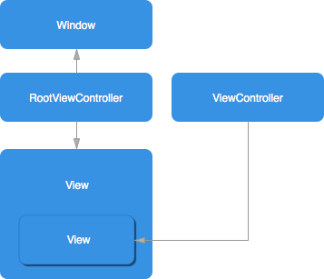
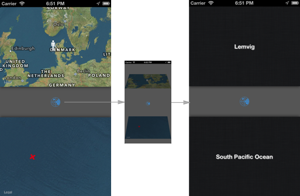

# View Controller 容器

在 iOS 5 之前，view controller 容器是 Apple 的特权。实际上，在 view controller 编程指南中还有一段申明，指出你不应该使用它们。Apple 对 view controllers 的总的建议曾经是“一个 view controller 管理一个全屏幕的内容”。这个建议后来被改为“一个 view controller 管理一个自包含的内容单元”。为什么 Apple 不想让我们构建自己的 tab bar controllers 和 navigation controllers？或者更确切地说，这段代码有什么问题：

    [viewControllerA.view addSubView:viewControllerB.view]

UIWindow 作为一个应用程序的根视图（root view），是旋转和初始布局消息等事件产生的来源。在上图中，child view controller 的 view 插入到 root view controller 的视图层级中，被排除在这些事件之外了。View 事件方法诸如 `viewWillAppear:` 将不会被调用。

在 iOS 5 之前构建自定义的 view controller 容器时，要保存一个 child view controller 的引用，还要手动在 parent view controller 中转发所有 view 事件方法的调用，要做好非常困难。

## 一个例子

当你还是个孩子，在沙滩上玩时，你父母是否告诉过你，如果不停地用铲子挖，最后会到达美国？我父母就说过，我就做了个叫做 _Tunnel_ 的 demo 程序来验证这个说法。你可以 clone 这个 [Github 代码库][3]并运行这个程序，它有助于让你更容易理解示例代码。（剧透：从丹麦西部开始，挖穿地球，你会到达南太平洋的某个地方）

为了寻找[对跖点][5]，也称作相反的坐标，将拿着铲子的小孩四处移动，地图会告诉你对应的出口位置在哪里。点击雷达按钮，地图会翻转过来显示位置的名称。

屏幕上有两个 map view controllers。每个都需要控制地图的拖动，标注和更新。翻过来会显示两个新的 view controllers，用来检索地理位置。所有的 view controllers 都包含于一个 parent view controller 中，它持有它们的 views，并保证正确的布局和旋转行为。

Root view controller 有两个 container views。添加它们是为了让布局，以及 child view controllers 的 views 的动画做起来更容易，我们马上就可以看到。

    - (void)viewDidLoad
    {
        [super viewDidLoad];

        //Setup controllers
        _startMapViewController = [RGMapViewController new];
        [_startMapViewController setAnnotationImagePath:@"man"];
        [self addChildViewController:_startMapViewController];          //  1
        [topContainer addSubview:_startMapViewController.view];         //  2
        [_startMapViewController didMoveToParentViewController:self];   //  3
        [_startMapViewController addObserver:self
                                  forKeyPath:@"currentLocation"
                                     options:NSKeyValueObservingOptionNew
                                     context:NULL];

        _startGeoViewController = [RGGeoInfoViewController new];        //  4
    }

我们实例化了 `_startMapViewController`，用来显示起始位置，并设置了用于标注的图像。

  1. `_startMapViewcontroller` 被添加成 root view controller 的一个 child。这会自动在 child 上调用 `willMoveToParentViewController:` 方法。
  2. child 的 view 被添加成 container view 的 subview。
  3. child 被通知到它现在有一个 parent view controller。
  4. 用来显示地理位置的 child view controller 被实例化了，但是还没有被插入到任何 view 或 controller 层级中。

## 布局

Root view controller 定义了两个 container views，它决定了 child view controller 的大小。Child view controllers 不知道会被添加到哪个容器中，因此必须适应大小。

    - (void) loadView
    {
        mapView = [MKMapView new];
        mapView.autoresizingMask = UIViewAutoresizingFlexibleWidth | UIViewAutoresizingFlexibleHeight;
        [mapView setDelegate:self];
        [mapView setMapType:MKMapTypeHybrid];

        self.view = mapView;
    }

现在，它们就会用 super view 的 bounds 来进行布局。这样增加了 child view controller 的可复用性；如果我们把它 push 到 navigation controller 的栈中，它仍然会正确地布局。

## 过场动画

Apple 已经针对 view controller 容器做了细致的 API，我们可以构造我们能想到的任何容器场景的动画。Apple 还提供了一个基于 block 的便利方法，来切换屏幕上的两个 controller views。方法 `transitionFromViewController:toViewController:(...)` 已经为我们考虑了很多细节。

    - (void) flipFromViewController:(UIViewController*) fromController
                   toViewController:(UIViewController*) toController
                      withDirection:(UIViewAnimationOptions) direction
    {
        toController.view.frame = fromController.view.bounds;                           //  1
        [self addChildViewController:toController];                                     //
        [fromController willMoveToParentViewController:nil];                            //

        [self transitionFromViewController:fromController
                          toViewController:toController
                                  duration:0.2
                                   options:direction | UIViewAnimationOptionCurveEaseIn
                                animations:nil
                                completion:^(BOOL finished) {

                                    [toController didMoveToParentViewController:self];  //  2
                                    [fromController removeFromParentViewController];    //  3
                                }];
    }

  1. 在开始动画之前，我们把 `toController` 作为一个 child 进行添加，并通知 `fromController` 它将被移除。如果 `fromController` 的 view 是容器 view 层级的一部分，它的 `viewWillDisapear:` 方法就会被调用。
  2. `toController` 被告知它有一个新的 parent，并且适当的 view 事件方法将被调用。
  3. `fromController` 被移除了。

这个为 view controller 过场动画而准备的便捷方法会自动把老的 view controller 换成新的 view controller。然而，如果你想实现自己的过场动画，并且希望一次只显示一个 view，你需要在老的 view 上调用 `removeFromSuperview`，并为新的 view 调用 `addSubview:`。错误的调用次序通常会导致 `UIViewControllerHierarchyInconsistency` 警告。例如：在添加 view 之前调用 `didMoveToParentViewController:` 就触发这个警告。

为了能使用 `UIViewAnimationOptionTransitionFlipFromTop` 动画，我们必须把 children's view 添加到我们的 view containers 里面，而不是 root view controller 的 view。否则动画将导致整个 root view 都翻转。

## 通信

View controllers 应该是可复用的、自包含的实体。Child view controllers 也不能违背这个经验法则。为了达到目的，parent view controller 应该只关心两个任务：布局 child view controller 的 root view，以及与 child view controller 暴露出来的 API 通信。它绝不应该去直接修改 child view tree 或其他内部状态。

Child view controller 应该包含管理它们自己的 view 树的必要逻辑，而不是把它们看作单纯呆板的 views。这样，就有了更清晰的关注点分离和更好的可复用性。

在示例程序 Tunnel 中，parent view controller 观察了 map view controllers 上的一个叫 `currentLocation` 的属性。

    [_startMapViewController addObserver:self
                              forKeyPath:@"currentLocation"
                                 options:NSKeyValueObservingOptionNew
                                 context:NULL];

当这个属性跟着拿着铲子的小孩的移动而改变时，parent view controller 将新坐标的对跖点传递给另一个地图：

    [oppositeController updateAnnotationLocation:[newLocation antipode]];

类似地，当你点击雷达按钮，parent view controller 给新的 child view controllers 设置待检索的坐标。

    [_startGeoViewController setLocation:_startMapViewController.currentLocation];
    [_targetGeoViewController setLocation:_targetMapViewController.currentLocation];

我们想要达到的目标和你选择的手段无关，从 child 到 parent view controller 消息传递的技术，不论是采用 KVO，通知，或者是委托模式，child view controller 都应该独立和可复用。在我们的例子中，我们可以将某个 child view controller 推入到一个 navigation 栈中，它仍然能够通过相同的 API 进行通信。

   [2]: http://img.objccn.io/issue-1/view-insertion.png
   [3]: https://github.com/RickiG/view-controller-containment
   [4]: http://img.objccn.io/issue-1/tunnel-screenshot.png
   [5]: http://en.wikipedia.org/wiki/Antipodes
   [16]: http://objccn.io/issue-1
